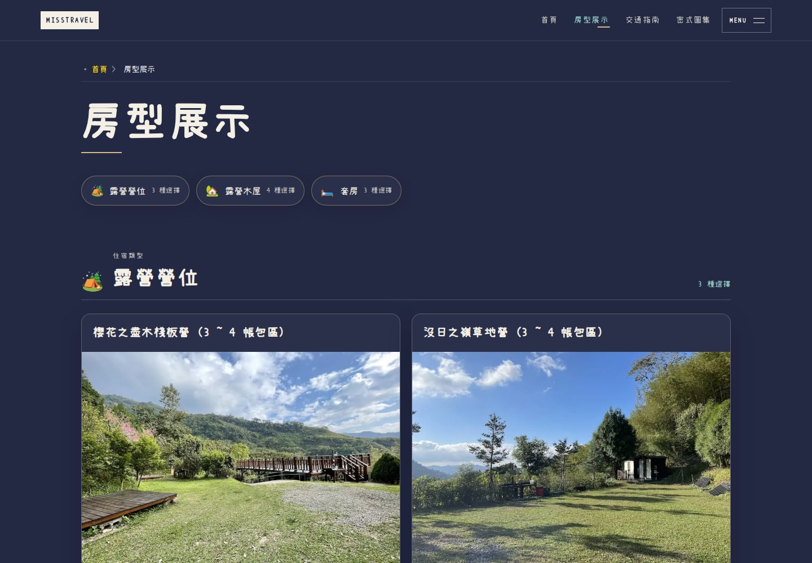
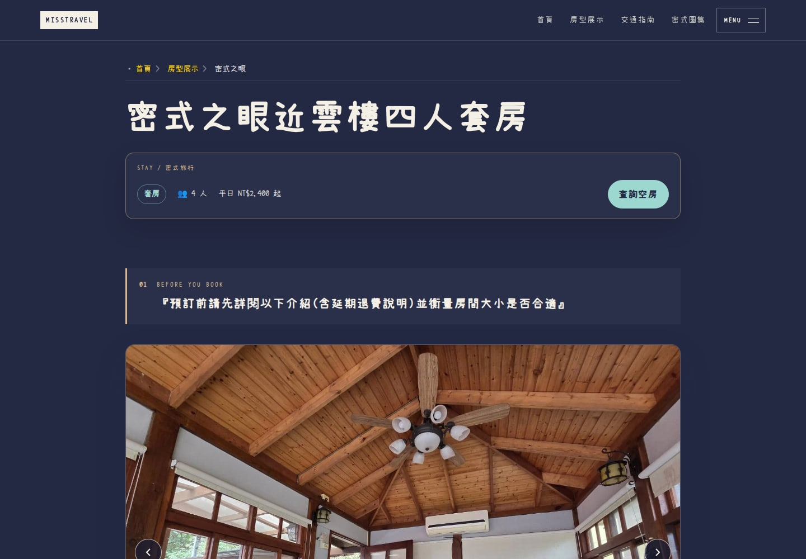
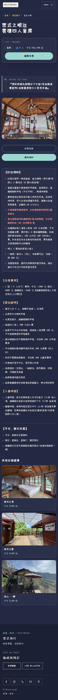
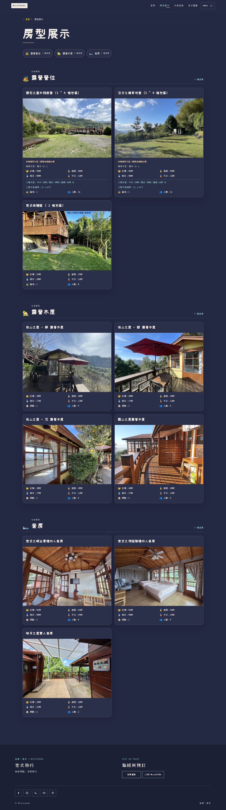
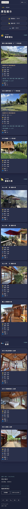

# 深色配色修正：PR #63

這份報告取代先前深淺混用的設計截圖。唯一設計指南仍是 [docs/DESIGN_GUIDE.md](../../DESIGN_GUIDE.md)。

## 直接驗收

[本機首頁](http://localhost:4336/) · [房型列表](http://localhost:4336/rooms/) · [四人套房](http://localhost:4336/rooms/suite_1/) · [三／四帳營位](http://localhost:4336/rooms/campsite_1/)

本機預覽已從使用者 Windows／WSL 電腦驗證，只適用該電腦，需保留 WSL 及預覽程序。[Vercel PR 預覽](https://misstravel-git-feat-editori-44e386-bag571ivy3470-1104s-projects.vercel.app) 保留原有帳號登入保護。

## 已修正

全站採深色，不隨作業系統明亮模式切成淺色。房型卡片、價格區、詳細閱讀區、預訂提醒、訂位須知與相關住宿卡片的米白大底已移除。背景為 `#242943`，面板為 `#2a2f4a`，米白只用於文字及小面積操作狀態；主要操作為水綠，香檳色只作細節。正文、價格、提醒與 hover／focus 的文字也一併改成適合深色的對比色，並非只換背景。

頁面不再另設房型專用色盤，全部引用 `global.css` 的共用配色。沒有圖片反相或全頁濾鏡，原照片不改色。

## 保留項目

這次源碼修改僅涉及兩個房型頁面的 CSS 及全站配色 token。兩頁的模板、文字、HTML、JavaScript 逐字比對不變，排版尺寸與互動邏輯保留。另更新單一設計指南及回歸測試。

重新建置後，26 個 HTML 頁面的正文、標題、連結、圖片屬性、metadata、canonical 及 JSON-LD 對照修正前完全相同。251 個原始內容、照片及字型檔的 SHA-256 完全相同，原工作目錄的未提交修改也保留。

網站實作版本：`5662328fd9892a58773938488de979471fbd5f06`。後續只追加本目錄的證據文件，不改網站。

## 驗證

| 檢查 | 結果 |
| --- | --- |
| 完整 verify | 24 個測試檔、233 個測試通過，npm audit 0 vulnerabilities |
| 瀏覽器 E2E | 22／22，`--retries=0`；包含新增 8 個深色回歸案例 |
| 整站訪客流程 | 419／419 通過；[逐項結果](visitor-acceptance.json) |
| 配色回歸 | 390／1440 寬度、作業系統 light／dark 偏好，檢查實際背景色；卡片 hover／focus 仍是深色且文字可讀 |
| 正文及 SEO 對照 | 26 頁，0 差異 |
| 原始內容／照片／字型 | 251 檔，0 差異 |
| axe | 10 個核心頁 × 2 種尺寸，共 20 組，0 violations；未將 incomplete 誤列為通過 |
| 獨立 AI 對抗審查 | [PASS，未發現新的阻擋缺陷](independent-review.md) |
| GitHub CI | [修正實作版本通過](https://github.com/Lawa0921/misstravel/actions/runs/34934698509) |

新增的配色測試已先在舊版執行，兩種寬度都因詳細頁仍是 `rgb(248,244,236)` 而失敗；修正後才通過。[修正前失敗紀錄](regression-before.txt)、[完整驗證](verify.txt)、[22 個瀏覽器案例](browser-tests.txt)、[內容與 SEO 比對](content-seo-invariance.json)、[實際背景色與 axe](visual-accessibility.json)。

獨立審查與實作使用不同的 AI 工作階段，審查讀取源碼、測試紀錄及最新截圖；不是人工使用者研究或無障礙認證。美感是否符合使用者期待仍由使用者看預覽驗收。此前通過的技術測試沒有防止深淺配色混用，本次已新增針對該錯誤的實際瀏覽器檢查。

### 驗收執行紀錄

第一次訪客流程執行期間，另一個 verify 曾重建同一個預覽目錄；該輪 768px 的訂房說明元素等待逾時，因此沒有採用它作為最終通過證據。建置固定後先重走同一個 768px 流程三次，皆為 200 並讀取到原訂房說明，再完整重跑 419 項，全部通過。沒有為此修改或放寬驗收程式。

## 最新實際畫面

### 桌機房型列表


### 桌機房型詳細頁


<details><summary>手機完整詳細頁（含正文與相關住宿）</summary>



</details>

<details><summary>房型列表完整頁面</summary>




</details>

## 重跑

```bash
cd astro-site
npm run verify
CI=1 PLAYWRIGHT_BASE_URL=http://127.0.0.1:4336 npx playwright test --retries=0
```

請在建置完成後才開始瀏覽器驗收，避免另一個 `verify` 重建同一個正在驗收的 `dist` 目錄。
