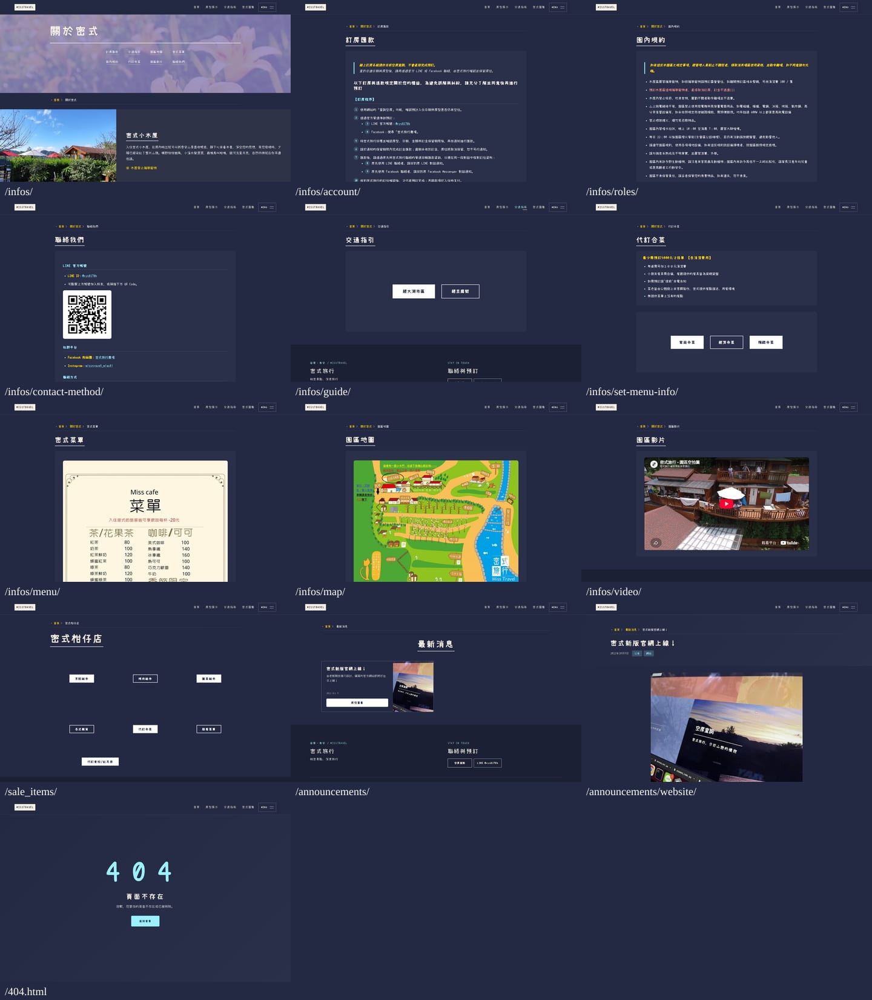
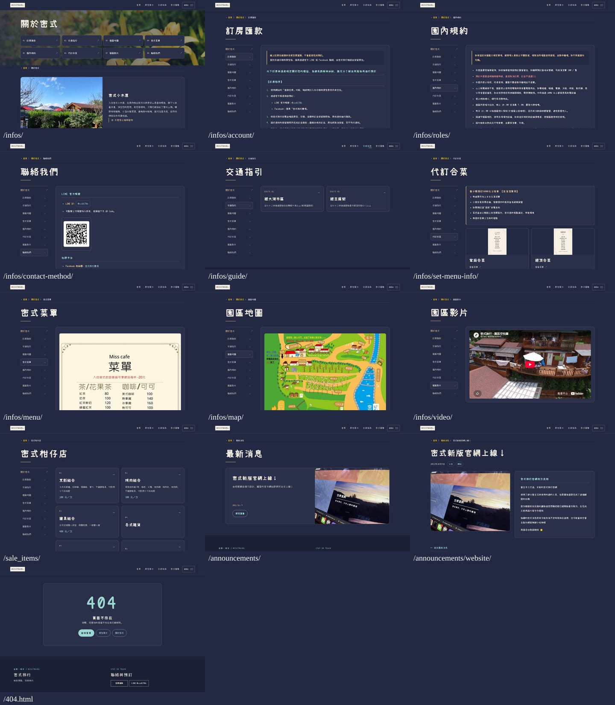
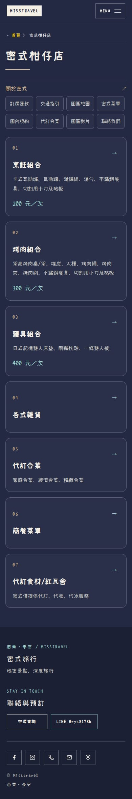
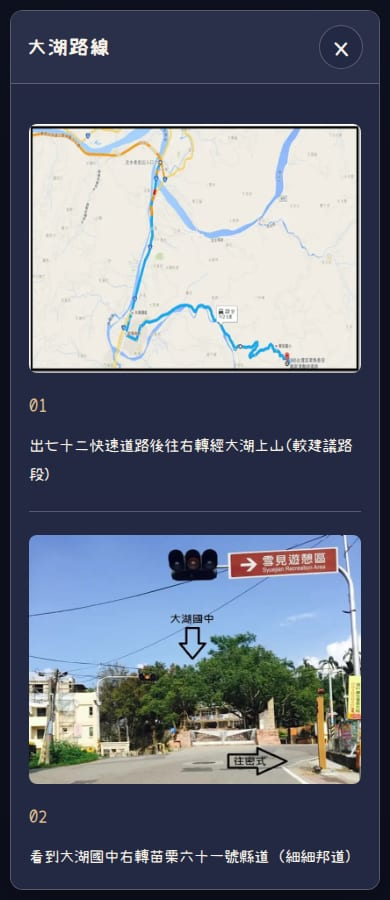
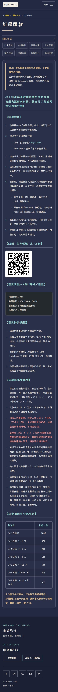

# 資訊頁、服務頁與彈窗補齊

使用者指出部分介面仍陽春。重新逐頁查看後，確實是原交付的介面覆蓋不足：交通頁仍是大空框中的兩個按鈕、柑仔店仍是分散的小按鈕，合菜、資訊長文、公告等也沒有套用完整新版排版。先前的功能／SEO 測試通過不能代表這些介面已完成設計。

本輪以 `1276582069e6d6d6ef92ac8f03840928ffd9fa51` 為基準，實作版本 **`d2521f4e05210eb7cb2feb3be0667be87d260cc8`**。此目錄的證據提交不改動網站實作。

## 實際驗收入口

[交通指引](http://localhost:4336/infos/guide/) · [密式柑仔店](http://localhost:4336/sale_items/) · [代訂合菜](http://localhost:4336/infos/set-menu-info/) · [訂房匯款](http://localhost:4336/infos/account/) · [聯絡我們](http://localhost:4336/infos/contact-method/) · [關於密式](http://localhost:4336/infos/) · [最新消息](http://localhost:4336/announcements/)

這些 localhost 網址適用使用者正在執行 WSL 預覽的電腦。[PR #63](https://github.com/Lawa0921/misstravel/pull/63) 的 Vercel 預覽沿用既有登入保護。未合併、不自動修改正式站。

## 覆蓋範圍

| 頁面／狀態 | 本輪呈現修正 |
| --- | --- |
| 關於密式 | 八個資訊入口改為可讀的導覽卡，原八段設施介紹以照片與文字區塊呈現，保留全部文字與原照片 |
| 訂房匯款、園內規約、聯絡方式 | 共用桌機側欄／手機換行導覽、閱讀寬度、段落層次與聯絡入口；原有條件、步驟、電話、QR Code 及帳戶資料未改 |
| 地圖、菜單、影片 | 共用資訊框架，保留原媒體；地圖與菜單增加原圖入口，不重畫菜單或改價 |
| 交通指引 | 兩個路線選擇卡帶出原有路線資訊，不再是空框置中按鈕；兩套完整圖文路線整理成逐段版面 |
| 密式柑仔店 | 七個服務入口皆成為可點擊卡片，前三項租用品顯示既有內容與同源租價；合菜摘要引用本站既有合菜頁內容；所有原彈窗內文保留 |
| 代訂合菜 | 三個菜單預覽卡、訂購條件面板、完整菜單彈窗 |
| 十二個彈窗 | 共用深色框架與清楚的標題；捲到底仍能操作的 44px 關閉按鈕；Escape／回復焦點／解除捲動鎖仍正常 |
| 公告列表／文章 | 清楚的文章卡片、原日期與原圖、正文閱讀區及返回入口 |
| 404 | 深色錯誤卡片與首頁／房型／資訊的返回路徑，保留 noindex |

全站維持 `#242943` 深藍底、`#2a2f4a` 面板、米白文字與水綠操作。不改首頁、房型既有設計或 SEO 模型。樣式由 `GuestNavigation.astro` 與 `guest-pages.css` 共用，移除被取代的舊頁面樣式，不在舊樣式上不斷加覆蓋層。

無 JavaScript 時，交通、合菜及租用品改為展開內容，補上路線圖片；不留下不可操作的按鈕。原始圖片中的白底（菜單、地圖、QR Code）不是介面面板，不以濾鏡反相。

## 驗證

- 完整 verify：26 檔、328 個測試通過，npm audit 0。
- 整站訪客流程：419／419 通過。
- 瀏覽器：35 個案例，不重試。包含這 13 個頁面在 360／390／768／1440 寬度，以及全部 12 個彈窗在手機／桌機的開啟、捲動、關閉和焦點回復；另有無 JavaScript 驗證。
- axe：13 頁與 12 彈窗 × 2 種尺寸，共 50 個狀態未發現 violations。incomplete 不當作通過，不宣稱完整 WCAG 認證。
- 26 頁 SEO metadata／canonical／JSON-LD，以及原有資訊、營運、服務彈窗的段落、連結、圖片來源／圖說及影片來源，以建置前後雜湊回歸比對保持一致。
- 251 個原始內容、圖片與字型檔完全未改，原工作目錄的未提交狀態保留。

## 修改前／後

### 修改前：13 頁

### 修改後：同樣 13 頁

### 手機柑仔店

### 手機交通彈窗

[初次獨立 AI 審查](independent-review-initial.md) 指出訂房頁閱讀樣式不足，未通過。本輪已補齊退費表格、警告引文、匯款區塊與重點文字的樣式，新增實際 computed-style 回歸測試，同時以 aria-describedby 讓租價及路線提示可被讀屏軟體讀到。圖片與影片也加入不可遺失的內容雜湊檢查，避免「文字沒變，但原圖不見」仍被判為通過。最新完整畫面已捲動載入所有照片後重新擷取。

[最終獨立複核](independent-review-final.md)、[驗證摘要](verification.json)、[完整瀏覽器結果](browser-tests.txt)、[整站訪客結果](visitor-acceptance.json) 與 [無障礙自動檢查](accessibility.json) 分開保存。

### 手機訂房說明與退費表格

畫面檢視、實際瀏覽器操作和自動測試不等於真人使用者研究，也不代表使用者已接受美感。外部 RoomCloud 訂房服務及原圖內容不在本輪介面重製範圍。

## 驗證界線與修正紀錄

獨立複核結論是這次修正 **PASS**，不是所有設計細節都沒有改善空間。50 組 axe 掃描的 34 組含有待判定的對比檢查，未將它們當作通過；原菜單／圖片、文字可讀性另經畫面檢查，但不等於完整 WCAG 認證。匯款原始程式碼區沿用既有 highlighter 的深灰底。表格仍採既有可水平捲動容器模式。

補充來源說明：本輪新增媒體雜湊由修改前保留的 `baseline-dist` 產生，並未用新版重建基準；文字及連結的舊雜湊沒有改寫。首次與最終獨立報告原文保留，協調者的補充不冒充審查結論。圖片原檔仍受 251 個檔案雜湊檢查保護；內容區媒體雜湊不是涵蓋全站每個 DOM 影像的宣稱。
