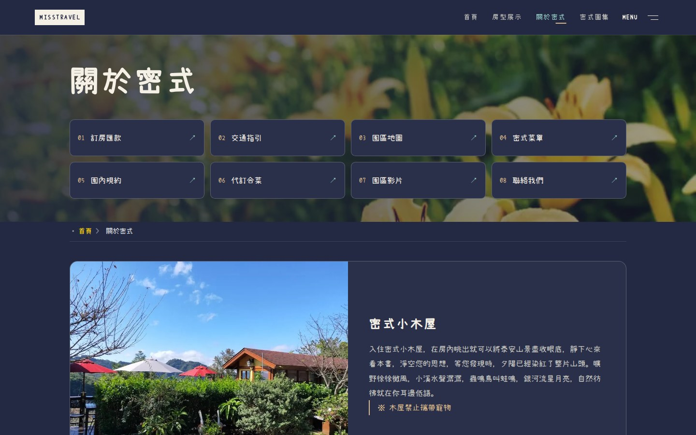
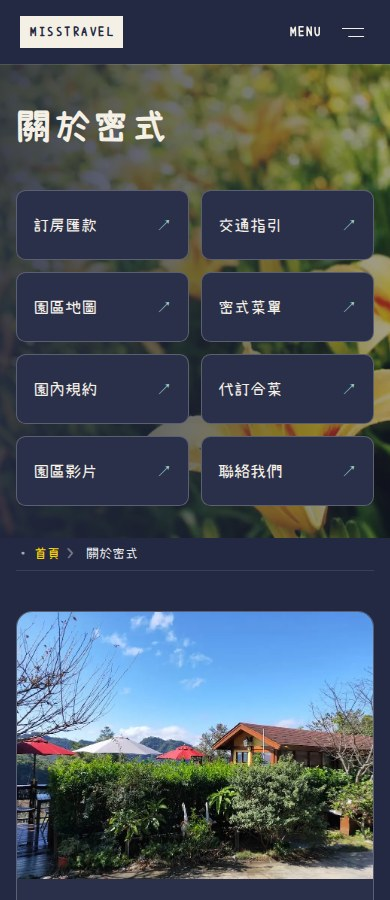
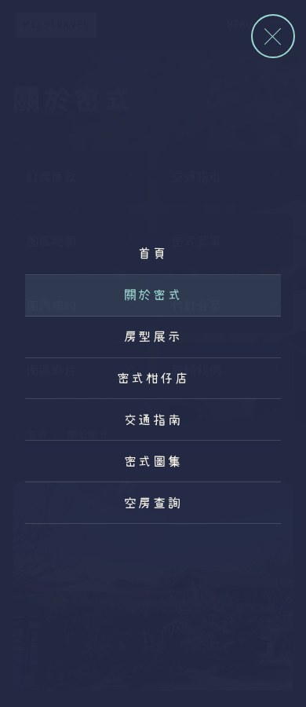

> 歷史版本：本頁的整頁淡入淡出／位移已由 [2026-09-16 情境式轉場](../2026-09-16-contextual-motion/README.md) 取代。Header 的關於密式入口與無框 Menu 保留。以下紀錄不改寫。

# 頁面切換與 Header 修正

對應使用者本次三項要求，網站實作版本 `eafc4458f9b31ecc484acd7918ff5491e3e7c048`。

## 直接驗收

[關於密式](http://localhost:4336/infos/) · [房型展示](http://localhost:4336/rooms/) · [首頁](http://localhost:4336/) · [PR #63](https://github.com/Lawa0921/misstravel/pull/63)

在本機先重新整理目前頁面，再點 Header 的「房型展示」與「關於密式」，即可看到新的切換。localhost 只適用使用者正在執行 WSL 預覽的電腦。[Vercel 預覽](https://misstravel-git-feat-editori-44e386-bag571ivy3470-1104s-projects.vercel.app) 保留原有登入保護。

[實際瀏覽器操作錄影（MP4）](assets/navigation-demo.mp4)。這是 Chromium 實際點擊與原生切換的錄影，不是重製畫面或模擬動畫。

## 三項調整

| 要求 | 實作 |
| --- | --- |
| 適合網站的頁面切換 | 深藍底、舊頁160ms淡出、新頁280ms淡入及8px微量位移。Header獨立保留在原位，沒有轉圈等待頁或攔截連結延遲。 |
| Menu 外框難看 | 移除常駐方框，改用文字加雙線圖示；hover只改水綠色及線條長度。鍵盤使用時仍有清楚focus提示，操作區至少44px。展開後的關閉控制也不再使用方框。 |
| Header 應為關於密式 | 頁首主要入口改成「首頁／房型展示／關於密式／密式圖集」。關於密式連至 `/infos/`，不是交通子頁；交通指南仍在完整選單及關於頁內。 |

## 相容性與行為

使用瀏覽器原生跨文件 CSS View Transition，不引入 SPA、路由套件、點擊攔截或人工等待。首次載入與不支援的瀏覽器維持正常頁面。啟用「減少動畫」時明確停用效果，沒有把正文設為透明等待 JS。頁內錨點不啟動跨頁切換，外部訂房連結與另開分頁行為不變。

從完整選單換頁時，在 pageswap 完成選單自己的淡出，防止舊選單遮罩留在過場快照；返回後仍可操作選單、沒有捲動鎖。實際測過原生上一頁回復閱讀位置，但不將該測試誤稱為已證明所有瀏覽器使用 back/forward cache。

技術參考：[Chrome 官方跨文件 View Transition 文件](https://developer.chrome.com/docs/web-platform/view-transitions/cross-document)、[MDN @view-transition](https://developer.mozilla.org/en-US/docs/Web/CSS/Reference/At-rules/%40view-transition)，2026-09-15 查核。瀏覽器支援不作為內容可用的前提。

## 驗證

- 完整 verify：26檔、328／328通過，Astro與TypeScript無錯誤；npm audit 0。
- 完整 Chromium E2E：68／68，`--retries=0`；其中7個新增測試專門驗證本次要求。
- 不是只檢查 CSS 字串：在真實換頁的 pagereveal／ready／finished 訊號中讀取動畫名稱，確認 mist-page-in、mist-page-out 實際執行；減少動畫情況確認不啟動。
- 手機／桌機檢查Menu無常駐框、44px操作區、鍵盤焦點、Escape與焦點回復；檢查Header實際文字、href和目前頁面標示。
- 驗證選單換頁的遮罩快照為opacity0、沒有捲動鎖、原生歷史閱讀位置回復、頁內錨點、停用JS及外部訂房連結。
- 26頁的title、所有meta、canonical、JSON-LD、完整main及footer HTML和主要sitemap／圖片sitemap／robots／feed，與改動前比對一致。Header導覽是本次明確授權的差異。
- 251個原內容／照片／字型檔SHA-256一致，原始工作目錄未提交修改保留，沒有變更價格、規則、字型、圖片或依賴套件。

[完整verify](verify-final.txt) · [68個瀏覽器案例](browser-final.txt) · [保留範圍逐頁結果](preservation.json) · [來源CI成功](https://github.com/Lawa0921/misstravel/actions/runs/34991358937)

[獨立程式與畫面審查](independent-review-initial.md)為PASS，但要求補上完整E2E證據；同SHA的68個完整結果已附上，再交[獨立證據確認](independent-review-final.md)。這是與實作分離的AI唯讀審查，不是真人批准或完整無障礙認證。

測試修正紀錄：早期觀測器在addInitScript階段先註冊pageswap，會在網站清理前讀到中間狀態。已改在DOMContentLoaded之後觀測，使讀值位於應用清理之後；原本要求opacity必須等於0的斷言沒有放寬。另將舊測試「Header需有交通子頁」更新為本次授權的關於總覽入口，且新增斷言保護完整選單仍有交通入口。

## 實際畫面

### 桌機：目前頁面與無框 Menu

### 手機

### 鍵盤焦點仍清楚可見

### 開啟選單

本輪只補拍改動的Header／Menu及操作錄影；原來52張整站完整圖屬於前輪版本，不冒稱本次重新拍過。內容與SEO由上述26頁比對及全套回歸確認保留。PR尚未合併，正式站未直接改動。
