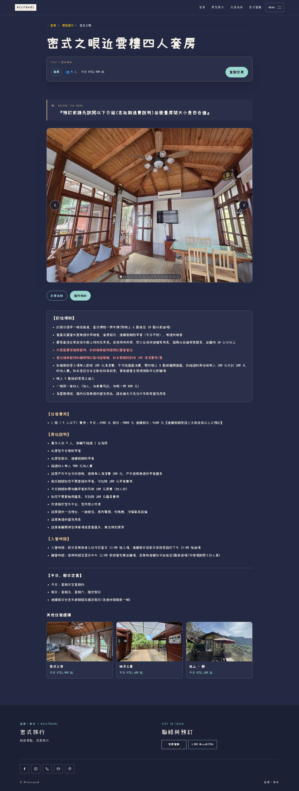
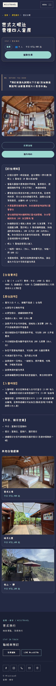
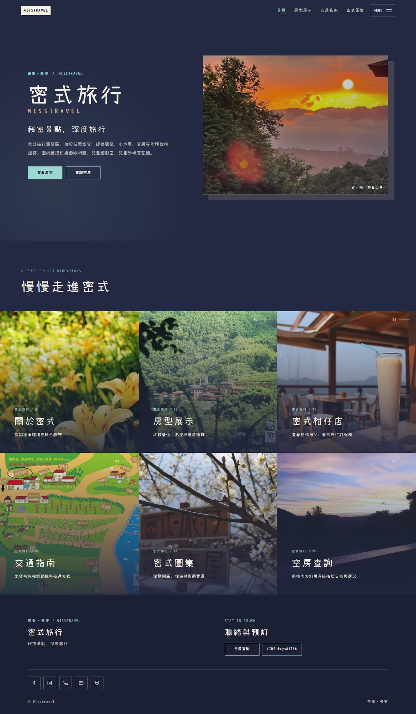
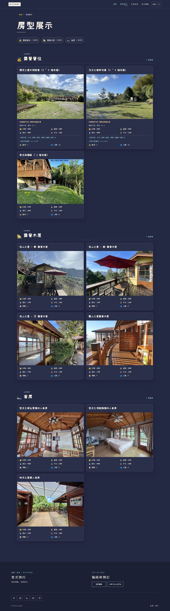

# 整站修正完成：房型 SEO、資料一致性與深色網站

> 後續介面補齊：本報告記錄 SEO 完成版本；資訊頁、服務頁與彈窗的最新畫面及驗收請見 [全站介面覆蓋報告](../2026-09-15-interface-coverage/README.md)。

本次實作來源：`f9ea6149d35e1646d1f136441ba7bc1eba4ea831`。這份報告取代前面「只完成部分 SEO」的交付狀態；深色設計保持不變。

## 驗收入口

[本機整站首頁](http://localhost:4336/) · [房型總覽](http://localhost:4336/rooms/) · [櫻花之盡](http://localhost:4336/rooms/campsite_1/) · [四人套房](http://localhost:4336/rooms/suite_1/) · [圖片網站地圖](http://localhost:4336/image-sitemap.xml)

本機預覽由使用者的 WSL 提供，只適用該電腦且須維持預覽程序。[Vercel PR 預覽](https://misstravel-git-feat-editori-44e386-bag571ivy3470-1104s-projects.vercel.app) 保留原有登入保護，匿名會轉去登入，不將登入頁當作網站驗收。PR #63 尚未合併，不直接變更正式站。

## 這次把哪些未完成項目補齊

| 問題 | 本次完成的實作 |
| --- | --- |
| 十個房型仍使用過度形容、重複手寫價格的摘要 | 十個房型 description／metaDescription 改為可對照正文的事實；餐點、公共設備與三／四帳條件分開，價格由資料產生 |
| 房型頁主要只有營區的 schema | 各自新增 Accommodation 與 WebPage，與原 LodgingBusiness 分開並連結；不是複製整個營區資料當房間 |
| 房型輪播仍寫「圖片第幾張」 | 核對127張不同原圖，統一來源供輪播、卡片、分享圖及 schema 使用，區分照片／尺寸圖／公告 |
| 房價複製到多個位置容易失去一致性 | 頂層價格是標準方案唯一價格來源，標準方案繼承；正文費用與摘要在建置時以安全的數值參照產生 |
| 非相鄰輪播照片只等使用者操作 | 新增 image-sitemap.xml 並由 robots.txt 宣告，保留既有延後下載，讓照片網址可被發現 |
| 分享圖片描述直接拿整頁摘要、資訊頁沒用自己的圖片 | og:image:alt／twitter:image:alt 改為實際圖說，菜單與地圖頁使用原有專屬圖片 |

原有36張圖集的描述也移到單一清單，圖集與圖片 sitemap 共用，避免各自寫死數量。新圖集清單不改任何既有圖集照片、順序或圖說。

## 目前實際輸出的十個房型摘要

以下不是草稿，直接從這個版本的建置 HTML 讀取。完整修改前／後欄位在 [seo-before-after.json](seo-before-after.json)。

| 房型 | meta description |
| --- | --- |
| 櫻花之盡木棧板營 (3 ~ 4 帳包區) | 密式旅行櫻花之盡木棧板營：三帳12人以下平日2400元，四帳16人以下平日3200元。線上系統顯示四帳價，三帳依現場帳數收費；連續假期限接三天兩夜以上預訂。 |
| 沒日之嶺草地營 (3 ~ 4 帳包區) | 密式旅行沒日之嶺草地營：草地約19乘12公尺，三帳12人以下平日2400元，四帳16人以下平日3200元。實際依帳數計價；連續假期限接三天兩夜以上預訂。 |
| 密式雨棚區 ( 2 帳包區) | 密式旅行雨棚區：兩帳包區適用8人以下，雨棚約11乘8公尺，提供流理台、衛浴與桌椅。平日1600元、假日2000元、連假2400元；連續假期限接三天兩夜以上預訂。 |
| 觀山之屋露營木屋 | 密式旅行觀山之屋四人露營木屋，附房外平台，使用公用流理台、衛浴及冰箱，無提供早晚餐。平日1200元、假日1700元、連假2000元；連續假期限接三天兩夜以上預訂。 |
| 依山之屋 - 靜 露營木屋 | 密式旅行依山之屋靜房：四人露營木屋，使用半個室外平台、公用流理台、衛浴及冰箱，無提供早晚餐。平日1200元、假日1700元、連假2000元；連續假期限接三天兩夜以上預訂。 |
| 依山之屋 - 默 露營木屋 | 密式旅行依山之屋默房：四人露營木屋，使用半個室外平台、公用流理台、衛浴及冰箱，無提供早晚餐。平日1200元、假日1700元、連假2000元；連續假期限接三天兩夜以上預訂。 |
| 依山之屋 - 沉 露營木屋 | 密式旅行依山之屋沉房：四人露營木屋，附涼亭與桌子，使用公用衛浴及冰箱，無提供早晚餐。平日1200元、假日1700元、連假2000元；連續假期限接三天兩夜以上預訂。 |
| 密式之眼近雲樓四人套房 | 密式旅行密式之眼近雲樓四人套房，附獨立衛浴、電視與冷暖氣。平日2400元不附早餐；假日4000元、連假4600元附早餐。連續假期限接三天兩夜以上預訂；加人及戶外搭帳條件見房型說明。 |
| 密式之頂閲陽樓四人套房 | 密式旅行密式之頂閲陽樓四人套房，附獨立衛浴、電視與冷暖氣，炊煮限室外平台。平日2400元不附早餐；假日4000元、連假4600元附早餐。連續假期限接三天兩夜以上預訂。 |
| 映月之屋雙人套房 | 密式旅行映月之屋雙人套房，附房內衛浴、電視與冷暖氣。平日1600元不附早餐；假日2500元、連假2800元附早餐。連續假期限接三天兩夜以上預訂。 |

## 資料模型的保護

四帳標準方案的價格與人數從房型頂層繼承，三帳方案維持自己的原價。費用段的數值參照只接受白名單內的非負整數，不執行運算式，不允許任意物件路徑；漏填、衝突、方案順序錯誤、不完整參照與多餘括號都使建置失敗。參照只用於建置，不依賴瀏覽器 JavaScript。修改測試中的單一房價，標準方案、費用文字和摘要會同步更新，替代方案不受影響。

十頁的完整房型正文、訂位須知與平假日定義均與遷移前逐字（標準化空白後）比對一致。實際費用、早餐／寵物／訪客／退費／入住規則不變。Markdown 原始檔有改動，因為重複費用換成數值參照；不能把這說成所有原始內容檔位元組都沒改。

一般可見頁面只增加相關營位卡片的「4 帳平日」價格語意及 NT$／千分位格式，金額不變；無 JavaScript 時另補齊原來漏掉的第二張輪播照片。既有深色 CSS、照片排序、原始照片檔與字型檔均不變。234個照片／字型檔已比對 SHA-256 一致。

## 結構化資料界線

Accommodation、WebPage、LodgingBusiness 使用各自固定 @id。住宿的 containedInPlace 指向營區，網頁 mainEntity 指向住宿，住宿 mainEntityOfPage 指回網頁；網站參照亦有明確名稱與網址。

沒有把可售房間庫存誤標成臥室數、沒有把基本入住人數當成無條件最高入住上限，沒有虛構 Offer、商品價格、即時空房、評分、評論或固定入住／退房時間。公告和尺寸圖不列為住宿實景圖。照片的內容描述不代表該物品一定免費提供；營運條件以原房型正文為準。

## 驗證

| 項目 | 結果 |
| --- | --- |
| 完整 verify | 25個測試檔、292／292測試通過，新增59項 SEO／資料模型測試 |
| npm audit | 0 vulnerabilities |
| Chromium | 25／25案例通過，retries=0，含深色一致性與新 SEO／無 JS 案例 |
| 整站訪客流程 | 419／419檢查通過，涵蓋25頁與360／390／768／1440寬度 |
| axe | 34組頁面／尺寸檢查，包括所有10個房型，0 violations；incomplete 不算通過 |
| 原始圖片及字型 | 234個檔案雜湊不變 |
| 來源版本 CI | [GitHub CI 成功](https://github.com/Lawa0921/misstravel/actions/runs/34942186883) |

[完整 verify](verify.txt)、[瀏覽器測試](browser-tests.txt)、[訪客逐項結果](visitor-acceptance.json)、[無障礙檢查與未能自動判定項目](accessibility.json)。自動檢查不是完整 WCAG 認證；沒有送出實際訂房、付款或對外訊息。

## 獨立對抗審查

[首次獨立複核](independent-review-initial.md) 為 PASS 並列出非阻擋精進項目；本次也補正參照邊界、圖集單一來源、尺寸圖分類、摘要事實範圍和價格格式，再由另一個唯讀 AI 工作階段做 [最終複核](independent-review-final.md)，結果 PASS。原始審查文字保留，不把作者修正說明冒充外部批准。這是獨立 AI 審查，不是真人使用者研究。

## 保持的畫面

手機版

首頁及房型總覽

## 維護與上線後觀測

資料維護方式與重跑命令見 [docs/SEO_CONTENT_MODEL.md](../../SEO_CONTENT_MODEL.md)，視覺仍只參考 [docs/DESIGN_GUIDE.md](../../DESIGN_GUIDE.md)。

網站端修正與搜尋成效是兩件事。PR 合併發布後，才應在 Search Console 檢查 URL 算繪／收錄、圖片 sitemap 及品牌／非品牌搜尋曝光與點擊。這次不宣稱排名、流量、CTR 或真實訪客 Core Web Vitals 已提升，也不保證住宿特殊搜尋結果資格。
