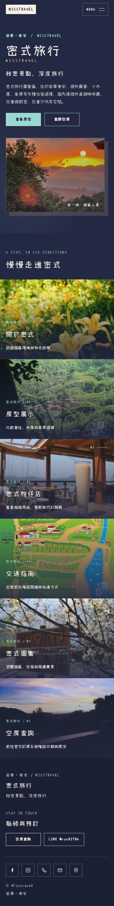
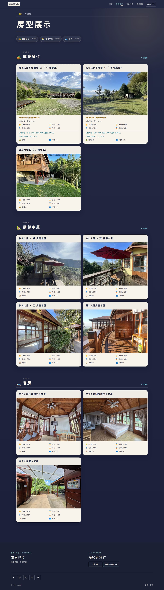
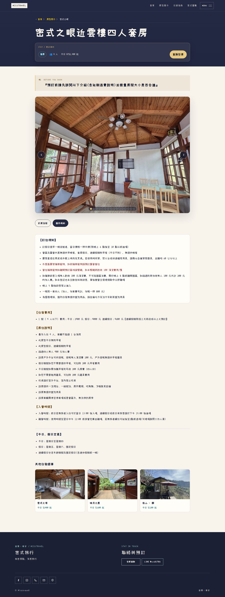
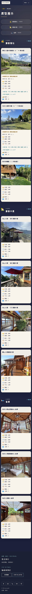
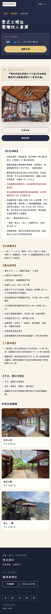

# 密式旅行：設計、SEO 與訪客驗收

驗收來源版本：`99799d9f758277ec82b43d86dd4dbea31d1c202b`。此目錄後續的報告／截圖提交不變更該網站實作。

## 可操作的預覽

- 使用者電腦本機：[新版首頁](http://localhost:4336/) · [房型列表](http://localhost:4336/rooms/) · [四人套房](http://localhost:4336/rooms/suite_1/) · [圖集](http://localhost:4336/galleries/)。已從 Windows 與 WSL HTTP 驗證；這些 localhost 網址只適用執行預覽的電腦，需保持 WSL 及預覽程序運作。
- [Vercel PR 預覽](https://misstravel-git-feat-editori-44e386-bag571ivy3470-1104s-projects.vercel.app)：部署 Ready，但匿名請求會轉至 Vercel SSO，需原有授權帳號登入。本次沒有關閉部署保護，也沒有把登入頁當作網站驗收通過。
- [PR #63](https://github.com/Lawa0921/misstravel/pull/63)。未合併，正式站未改動。

## 這一版調整了什麼

保留既有深藍與原照片，以清楚的照片主視覺、原生導覽連結與留白建立閱讀層次。首頁六個入口整張卡片可點擊；房型依分類呈現，詳情頁以米白閱讀區讓費用、規約與入住條件保持完整展開。手機版沒有遮住內容的底部浮動列。

三帳與四帳沿用原價，分別帶出 12／16 人適用範圍；最低方案仍在前。沒有方案資料的房型不新增「標準方案」名稱。所有原始房型正文、餐點條件、寵物／訪客規則、訂房匯款與聯絡資料均不改寫。

SEO 改善包括頁面專屬中文標題、穩定實體識別、36 張照片逐張核對後的描述，以及縮圖／放大圖／ImageObject 描述一致。既有 canonical、sitemap、sameAs、歷史網址轉址、404 與原訂房連結保留。未加入不存在的評論、即時房況或不正確的房型商品價格 schema。

唯一設計規範是 [docs/DESIGN_GUIDE.md](../../DESIGN_GUIDE.md)。這份驗收報告不是第二份設計規範。

## 驗證結果

| 項目 | 實測結果 |
| --- | --- |
| 完整 verify | 24 個測試檔、233 個測試通過；Astro／TypeScript 無錯誤 |
| npm audit | 0 vulnerabilities；沒有略過安全檢查 |
| Chromium E2E | 14／14 通過，含減少動畫偏好的鍵盤焦點回復 |
| 圖集焦點壓測 | 3 個情境各執行 10 次，30／30 通過，retries=0 |
| 訪客黑箱驗證 | 419／419 檢查通過 |
| 響應式頁面 | 25 頁各以 1440／390 寬度檢查，再以 360／768 檢查 10 個主要頁面，共 70 組 |
| axe 自動檢查 | 10 個主要頁面 × 2 種寬度，20 組未發現違規 |
| 原始內容／照片／字型檔 | 251 個受保護檔案 SHA-256 均未改動 |
| 原始工作目錄 | 保留所有原有未提交修改，使用獨立 worktree |
| GitHub CI | [來源實作版本 CI 通過](https://github.com/Lawa0921/misstravel/actions/runs/34932000231) |

[機器可讀摘要](verification-summary.json)、[419 項逐項結果](visitor-acceptance.json)、[axe 結果](accessibility-audit.json)。

訪客流程不是只檢查元素存在：實際點首頁照片進房型、跳轉套房分類、讀取費用／早餐條件、進訂房說明、操作選單與圖集、確認 Escape 與焦點回復；另測正常動畫、減少動畫及停用 JavaScript。未送出實際訂房、付款或對外訊息。

## 獨立對抗審查

審查使用與實作不同的 Claude AI 唯讀工作階段，不是由同一個實作工作階段自稱通過，也不是人工第三方認證。

[第一輪獨立審查](independent-review-initial.md) 提出了測試與焦點保護、價格方案語意、空白字形、整張卡片點擊等阻擋問題。[逐項修正回應](review-response.md) 、[第二輪獨立複核](independent-review-second.md)、[目前頁面修正複核](independent-review-third.md) 與 [最終獨立複核（PASS）](independent-review-final.md) 分開保留，以免把協調者的說明冒充獨立批准。

### 最後一個時序缺陷

最後一輪曾出現一次圖集關閉後焦點失去的間歇失敗，沒有只依靠重試交付。新增的確定性案例會排住開啟時的動畫回呼、關閉圖集後再放行，修正前可重現失敗；修正後，已關閉或已切換的對話框不再接受過期焦點回呼。三個相關情境各測十次，無重試共 30 次全數通過，最終完整瀏覽器套件也以 `--retries=0` 通過 14 個案例。

[修正前失敗](dialog-focus-regression-red.txt)、[修正後 30 次結果](dialog-focus-regression-green.txt)、[完整瀏覽器測試](browser-tests.txt)、[完整 verify](verify.txt)。最終獨立 AI 複核確認此改動邏輯正確，沒有新的阻擋缺陷；此前報告列出的非阻擋精進項目仍保留，不宣稱網站毫無改進空間。

## 字型的精確處理

原始 `setofont.woff2` 完全未改動。實際輪廓檢查發現「鄉」（U+9109）與「閱」（U+95B1）雖然有字元對應，卻是空白輪廓。本版只以 CSS `unicode-range` 排除這兩個碼位，交由原本就存在的 `sans-serif` fallback 顯示；其餘碼位仍使用原字型。沒有下載、替換、擴充或重製字型檔。新增的介面文案另外通過原字型字元覆蓋與 SHA 測試。

## 實際畫面

### 桌機首頁


<details><summary>手機首頁</summary>



</details>

<details><summary>桌機房型列表與詳細頁</summary>




</details>

<details><summary>手機房型列表與詳細頁</summary>




</details>

## 重現驗證

在 `astro-site/` 執行：

```bash
npm ci
npm run verify
npm run test:e2e
```

已有本機建置預覽時，可在另一個終端使用：

```bash
CI=1 PLAYWRIGHT_BASE_URL=http://127.0.0.1:4336 npm run test:e2e
ACCEPTANCE_BASE_URL=http://127.0.0.1:4336 node scripts/visitor-acceptance.mjs
```

驗收程式會讀取現有正式站作營運文字比對，並還原 Cloudflare 對公開 Email 的標準混淆文字；不讀取私人認證資訊。合成瀏覽器流量會停用 analytics beacon，避免污染正式統計。輸出預設存於未版控的 `test-results/visitor-acceptance/`。

## 驗證界線

這是實際建置、瀏覽器自動操作、獨立 AI 程式審查與畫面檢視，不是人體使用性研究或完整 WCAG 認證。本次沒有衡量 Search Console 排名、自然點擊率或真實訪客 Core Web Vitals，不宣稱 SEO 排名一定提升。Vercel 的部署成功與匿名可開啟是不同的檢查；登入保護維持原樣。
