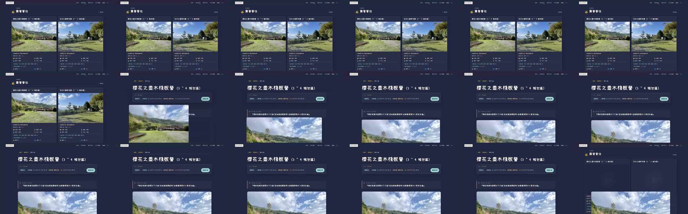
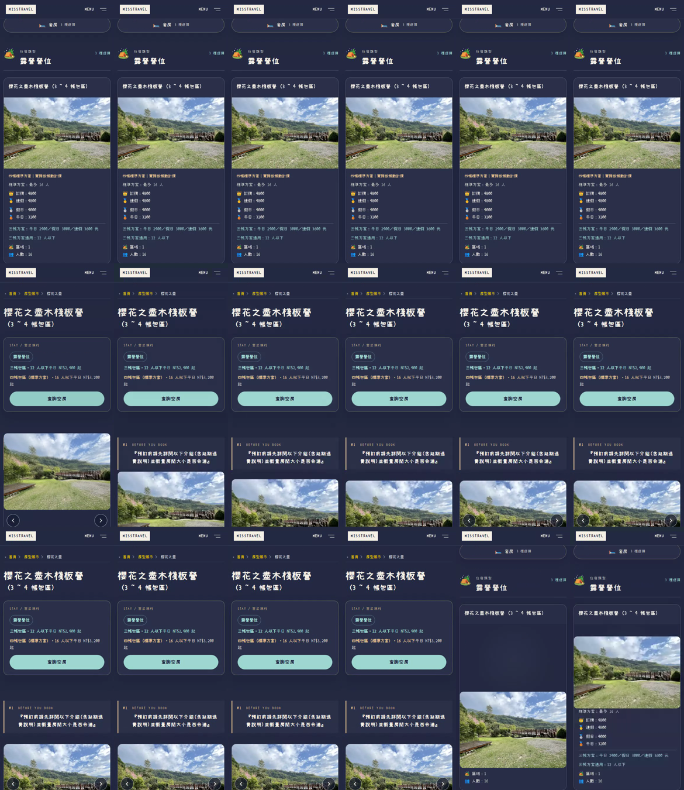

# 導覽重做：清楚切換與房型照片銜接

使用者明確不接受上一版整頁淡入淡出／上下位移。本版替換其互動模式，不以加快同一套動畫交差。網站執行來源：`3971d3521796b382f796336bb3413695a5efce83`；後續報告提交不變更網站。

## 實際驗收

[房型列表](http://localhost:4336/rooms/) · [關於密式](http://localhost:4336/infos/) · [PR #63](https://github.com/Lawa0921/misstravel/pull/63)

先重新整理已開啟的本機頁面，再使用 Header 在關於密式／房型之間切換；接著點一張房型照片進詳情，按上一頁。localhost 只適用執行 WSL 預覽的使用者電腦。[Vercel 預覽](https://misstravel-git-feat-editori-44e386-bag571ivy3470-1104s-projects.vercel.app) 保留原 SSO 保護。

[桌機實際操作錄影](assets/navigation-1440.mp4) · [手機實際操作錄影](assets/navigation-390.mp4)

影片是正常速度下的原生瀏覽器操作，不是放慢動畫、改 CSS 或合成原型。錄影經轉碼但未加速／減速。以下連續畫格為同一錄影的 12fps 擷取：

手機照片銜接畫格

## 行為設計

| 操作 | 本版反應 |
| --- | --- |
| Header 一般導航 | 舊頁文字快照立即移除；新頁 140ms 從 0.86 收斂到完整不透明，沒有上下移動、模糊、整頁縮放或兩頁文字交疊。Header 保持原位。 |
| 點房型進詳情 | 只有點選的同一張照片，在約 300ms 內從列表位置銜接到詳情主圖，已有照片保持可見；其他卡片不飛入、不跟著縮放。 |
| 返回房型列表 | 保留瀏覽器原本的閱讀位置；目標照片已在畫面且載入時反向銜接。若瀏覽器在 pagereveal 之後才恢復捲動，直接正常返回，不強行捲動來演出動畫。 |
| 首屏進場 | 不再把原本 750ms 的卡片淡入疊在換頁之後，導航抵達時所有卡片直接呈現，避免稍晚恢復的閱讀位置又重播淡入；既有 hover 行為保留。 |
| 圖片未載入、已切換輪播、相片不在畫面／暫存不可用 | 正常換頁，不讓訪客等候動畫，也不把錯誤照片接成主圖。 |
| 減少動畫或不支援 | 保持普通導航及原始內容／連結；不依賴動畫才能使用。 |

本版不是 SPA。未攔截 click、未新增 fetch／頁面重寫、未操縱 history 或等待計時器。5KB 左右的 head 腳本只處理原生 transition 事件及同分頁單次圖片配對；返回時最多讓一張已看過的圖片提早載入，其他圖片仍 lazy。沒有新增依賴、字型或圖片檔。

## 驗證

獨立審查先提出兩個阻擋項目：殘留的 opacity/filter 轉場，以及缺乏真正 BFCache 的測試。已針對導航卡片明確限定只轉場 transform／box-shadow，並加入必須實際播放的返回案例。另用完整 Chromium（不是禁用 BFCache 的 headless-shell）實際驗證 `pageshow.persisted === true`，返回後無殘留照片名稱，接著一般導航也不帶入舊照片。沒有把重新載入冒稱成 BFCache。

完整 verify 為 **328／328**、npm audit 0；完整 Chromium E2E **96／96（命令明確 --retries=0）**，新增28個情境檢查。這些數字是功能證據，不等於使用者已接受美感。

十個房型各以390／1440寬度驗證前進的照片配對、清除暫時名稱，以及返回時的正確配對或明確原生備援。一般導航檢查舊 root 不繪製、沒有 root transform／filter、Header 無動畫、首屏不重播淡入，並保留選單、錨點、鍵盤、減少動畫、停用JS及訂房目的地的既有檢查。

**測試界線：**最初的測試要求每次返回都必須動畫，對原生捲動恢復較晚的頁面是不正確的需求。測試現在先觀測目標在 pagereveal 是否可見且載入：符合時要求真實共享照片動畫；不符合時要求動畫確實跳過、內容可見、最終閱讀位置正確。不是把任意失敗都當作成功。新的圖片配對測試以 CDP 阻擋 analytics，不以 route 攔截關掉全瀏覽器快取；既有導航測試仍測原先的攔截環境。歷次失敗診斷保留於工作區，不將其偽裝成通過。

26個頁面的title、metadata、canonical、JSON-LD、正文、footer、全部連結與既有圖片屬性均保持一致，唯一新增圖片屬性是data-room-photo。robots、兩種sitemap與feeds未改。251個原內容／照片／字型檔 SHA-256 一致，原始工作目錄未提交修改保留。Header仍為無框Menu與關於密式入口。

[完整程式驗證](verify.txt) · [完整瀏覽器測試](browser-tests.txt) · [內容與SEO前後對照](preservation.json) · [機器摘要](verification.json) · [首次獨立AI審查](independent-review-initial.md) · [修正後獨立複核](independent-review-final.md)

本次不重新宣稱已拍完26頁52張截圖；本次變更只有過場與配對屬性，靜態頁面由前後比對及既有回歸測試保護。獨立審查使用唯讀AI，並非真人設計驗收、完整無障礙認證或搜尋排名成效。

## 平台依據

[Chrome：跨文件 View Transition、pageswap／pagereveal](https://developer.chrome.com/docs/web-platform/view-transitions/cross-document) · [MDN：pagereveal](https://developer.mozilla.org/en-US/docs/Web/API/Window/pagereveal_event)。腳本在head提早註冊，未將transition或Navigation API支援當作網站功能的前提。

[一般導航連續畫格](assets/ordinary-sequence-1440.png) · [返回列表連續畫格](assets/back-sequence-1440.png)。兩段均出自最終版本的同一段正常速度錄影；返回完成後的捲動是測試使用者接著切至套房類別，不是額外的轉場位移。

## 最終獨立複核

[修正後獨立複核](independent-review-final.md)確認B1／B2阻擋問題關閉，結論PASS。首輪NEEDS CHANGES原文保留，沒有將其改寫成通過。評審實際看了正常導覽、照片前進與返回的錄影畫格，也讀取最終SHA的完整96個瀏覽器測試與328個程式／內容測試。

這不是美感已獲使用者認可：網路載入時其他未載入卡片可能短暫保留空位；共享照片移動時目標照片區保留位置，圓角與短暫亮度收斂仍可依實際使用回饋精修。轉場不等待這些資源，也不以人工延遲來掩飾。外部訂房／營運條件與原字型均未改。

## 後續整體互動版本

本報告保留原換頁效果的驗收結果。後續已加入大字照片導覽、房型比較、閱讀位置導覽與共用完整看圖介面，最新操作錄影與驗證請見 [整體互動重設](../2026-09-16-modern-interactions/README.md)。
