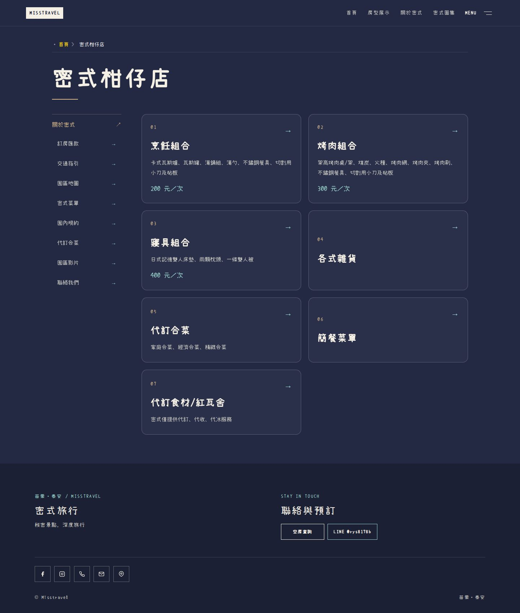

# Search Console 問題修正交付

實作／最終測試來源：`609aa4f4a56fd94793700974ac70c081b5b47d00`。基準：已合併 PR #64 的 `05899e7e6a0fd596c03535801f8ca27db2f3d753`。本輪 [PR #65](https://github.com/Lawa0921/misstravel/pull/65) 尚未合併，不直接改動正式站。

## 驗收入口

[本機柑仔店](http://localhost:4336/sale_items/) · [舊房型網址測試](http://localhost:4336/rooms/2022-10-07-campsite_1.html?keep=1) · [舊影片網址測試](http://localhost:4336/infos/2022-10-07-video.html) · [新版 sitemap index](http://localhost:4336/sitemap-index.xml)

本機4336由測試用HTTP伺服器執行Vercel官方routing-utils編譯的轉址規則，再讀取4340的Astro正式建置預覽。它讓驗收者能實際點擊舊網址看到HTTP308和新頁，而不是只有一份JSON設定。這不是Vercel邊緣部署、CDN或SSO的完整模擬；需保留本機兩個程序運作。

[Vercel雲端預覽](https://misstravel-git-fix-gsc-disc-a6e877-bag571ivy3470-1104s-projects.vercel.app/sale_items/)部署Ready，但匿名請求仍轉原有Vercel SSO。本輪沒有停用存取保護或使用憑證繞過，不能拿本機HTTP通過當作雲端轉址已實測。

## 1. 舊日期網址轉址

依Git歷史`1041513^`的Jekyll來源，而不是猜測截斷網址，盤點19個可確定後繼頁的舊頁：10個房型、8個資訊頁、1個公告。每頁同時處理舊`.html`及過去通用規則錯轉出的帶日期`/`路徑，共38條精確對應；其中34條本次新增、4條原已存在。

| 原網址 | 本輪目標 |
| --- | --- |
| `/rooms/2022-10-07-campsite_1.html` | `/rooms/campsite_1/` |
| `/rooms/2022-10-07-log_cabin_1.html` | `/rooms/log_cabin_1/` |
| `/infos/2022-10-07-video.html` | `/infos/video/` |
| `/infos/2022-10-08-contact-method.html` | `/infos/contact-method/` |

[完整19份來源及對應](../../../astro-site/tests/fixtures/legacy-dated-routes.json)記錄在測試fixture。規則優先於通用slug規則，保留查詢參數與既有非www→www。未知／截斷路徑不猜測、不統一導回首頁；正常404不是必須清零的缺陷。

正式路由smoke由實際設定載入全部舊日期規則，涵蓋49條舊網址（不再只測原15條）。合併後必須執行此檢查才能確認公開Vercel轉址生效，並再由Google重新檢索；轉址來源不必獨立收錄。

## 2. 租借組合的機器可讀語意

烹飪／烤肉／寢具原頁明示「租用」、每次費用與歸還條件，並非此頁可直接購買的零售商品。本版以三個`Service`描述，保留原供應者，`Offer.businessFunction`明確為`LeaseOut`，價格維持200／300／400 TWD，`referenceQuantity`保留每次計價。

Schema.org的Product廣義上可以描述租借，不能說原型別在語法上完全非法。但Google Merchant購買體驗不是這些租用品的目標，因此不捏造商品照片、即時庫存、配送或零售退貨條件來追求該報表全綠。改成Service不承諾取得商品複合式搜尋結果，也不保證歷史Merchant報表立即消失。既有Organization、BreadcrumbList及所有價格／條款／照片保持原值。

- [Google Product體驗分類](https://developers.google.com/search/docs/appearance/structured-data/product)
- [Schema.org Service](https://schema.org/Service) 與 [Offer](https://schema.org/Offer)

## 3. Sitemap 探索入口與後台界線

既有`@astrojs/sitemap`使用官方`customSitemaps`設定，在sitemap-index.xml同時列出25頁的sitemap-0.xml與原有image-sitemap.xml。沒有重建第二套產生器、改名避開錯誤、捏造lastmod或更動原25頁清單。原圖網址、robots及feeds均不改。

本機／普通HTTP可讀、Google接受提交、Google實際擷取、Google建立索引是四種不同狀態。使用者授權的後台重新提交與即時擷取診斷另保留私人紀錄，不把帳號或完整GSC報表提交公開repo。Google後台尚有待重新處理的記錄，不宣稱此PR已讓全部GSC錯誤歸零。

依[Google官方診斷流程](https://support.google.com/webmasters/answer/7451001?hl=zh-Hant)，Sitemap無法擷取應以網址檢查的**即時測試→網頁可用性**核對「允許檢索／擷取成功」，不是以XML是否被當成普通搜尋結果收錄來判斷，也不要求XML本身建立索引。未部署的舊網址／Service修正不會提前按「驗證修正後的項目」。

## 測試與對抗審查

| 項目 | 結果 |
| --- | --- |
| 新回歸測試修正前 | 21失敗／2通過，重現19種轉址錯誤、3個Product及圖片Sitemap入口遺漏 |
| 最終完整verify | 33檔、375／375；npm audit0、Astro／TypeScript無錯誤 |
| 最終完整Chromium E2E | 156／156，retries=0；原153例及新增3個實際HTTP／導航案例 |
| 新HTTP測試涵蓋 | 38個舊網址→HTTP308→對應200＋canonical、查詢保留、未知404、真正點進房型讀取原早餐條件 |
| 精確保留 | 26頁可讀正文、metadata、連結、原圖屬性與其他schema不變；原sitemap-0／image-sitemap／robots／feeds位元組不變 |
| 原檔保護 | 251個內容、原圖及字型檔SHA-256全相同；CSS和客戶端動效程式未改 |
| 來源版本CI | [609aa4f CI成功](https://github.com/Lawa0921/misstravel/actions/runs/35081714223) |

[修正前失敗](regression-before.txt) · [最終verify](verify.txt) · [156項瀏覽器紀錄](browser-tests.txt) · [保留證據](preservation.json) · [摘要](verification.json)

[獨立唯讀AI審查](independent-review.md)對本輪網站程式與初版回歸測試為PASS，無P0/P1；P2要求納入未追蹤測試、確認供應者實體、驗證Vercel路由，已逐項補齊。最後補充測試框架的第二次AI複核因審查服務額度未完成，沒有把這次失敗冒稱為最終獨立批准。補充框架由協調者讀碼及最終375／156測試驗證。此為AI靜態審查，不是人工SEO、無障礙或Google認證。

## 畫面保持不變


<details><summary>桌機柑仔店</summary>



</details>

本輪只改路由與搜尋語意，不重新設計你已認可的介面。原始工作目錄及前輪未提交錄影資產均保留。

## 合併後的驗收順序

```bash
cd astro-site
npm run smoke:production
node scripts/production-route-smoke.mjs
```

確認公開舊網址確實到新頁、公開柑仔店只有Rental Service而無Product、公開sitemap-index包含兩份子檔後，再請Google重新擷取該公開版本。保留兩種未知截斷404及正常轉址／feed非索引記錄，不為了報表數字造假。Search Console索引／商品報表更新與搜尋曝光成長需另觀測，這次不宣稱排名已提升。
