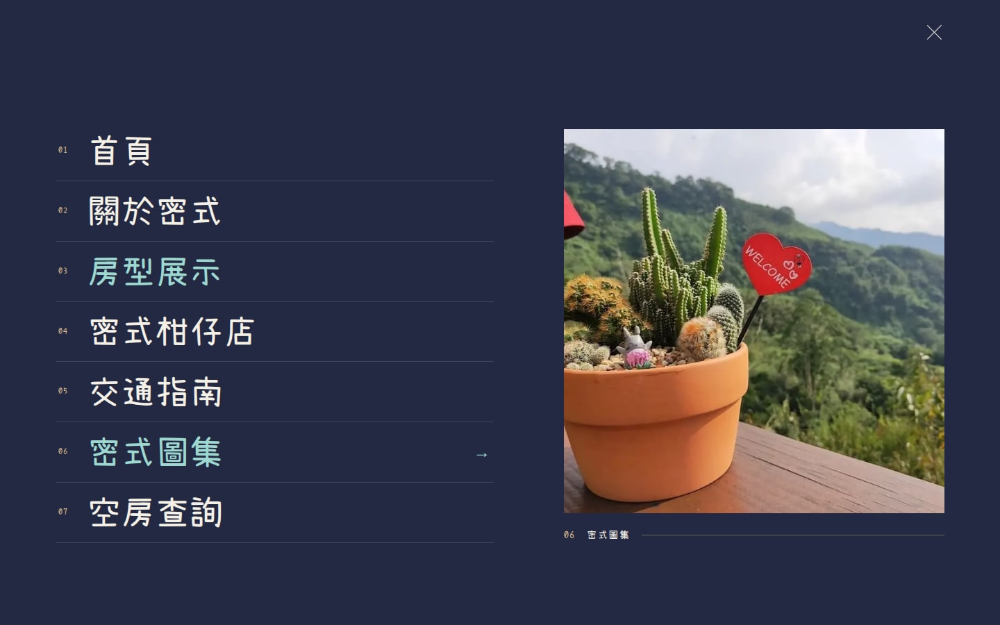
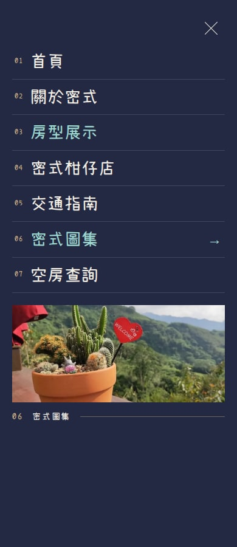
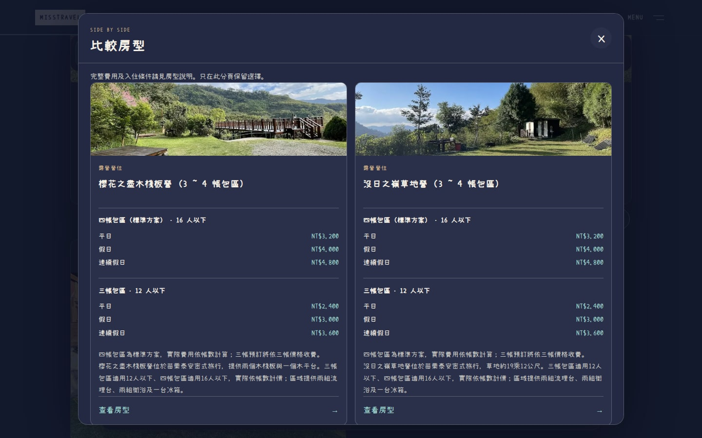
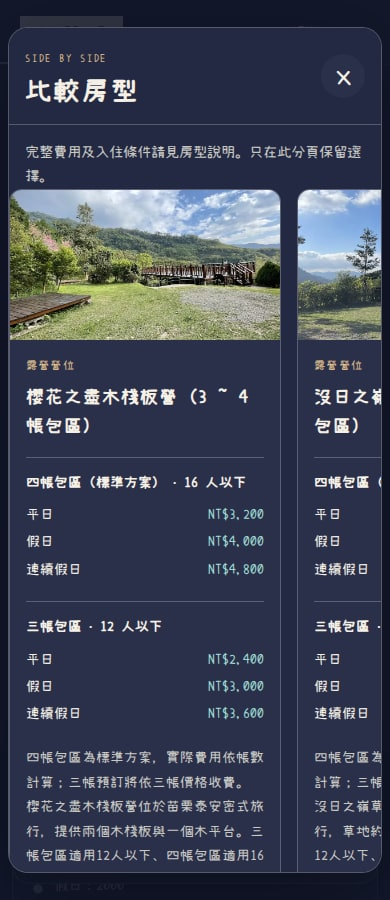
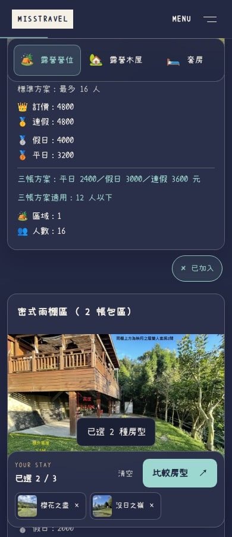
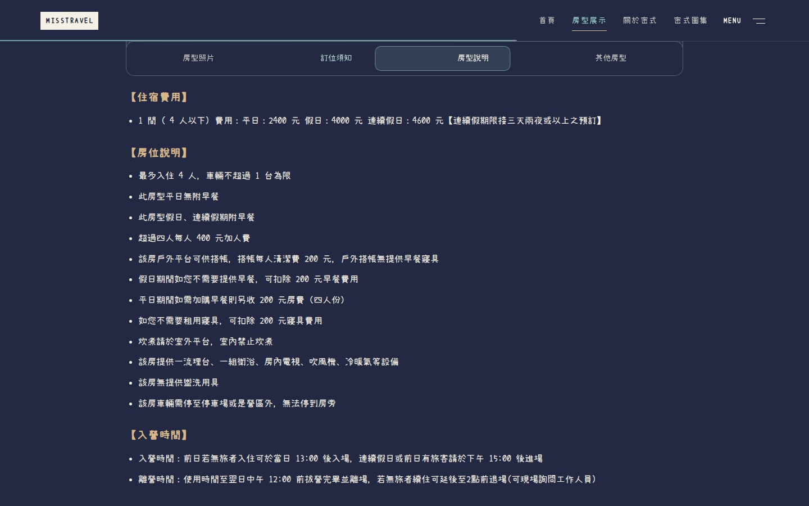
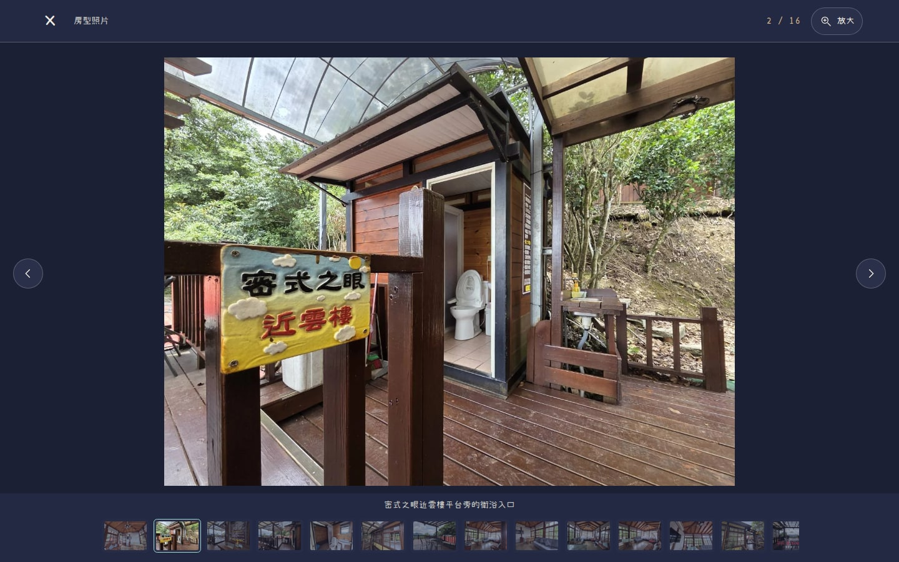
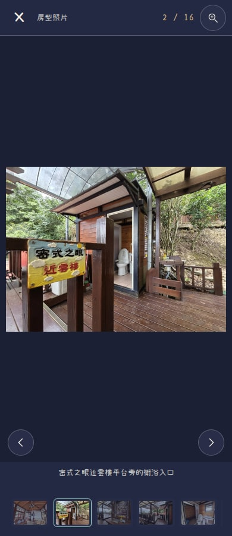
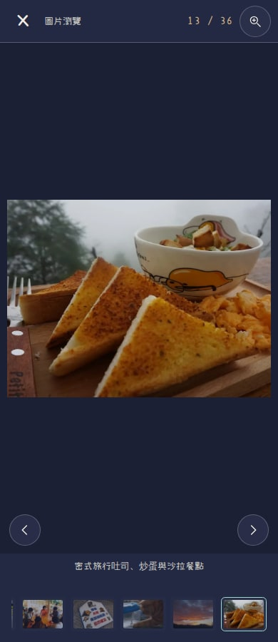

# 密式旅行：導航、選房與看圖互動重設

本次不再只調整換頁效果，而是補上可連續操作的選房流程。最終程式與測試驗證版本：`1486e5cbb425459cf10bab5226f578728017a062`。執行程式為 `5d599e140848c6a168d99faea86e7ee73071bc34`，之後只調整瀏覽器測試設定。以 `7b5c19d6258213e38858dc2a01324969a656d540` 為基準；本目錄後續證據提交不改變網站執行程式。

## 實際驗收

[新版房型列表](http://localhost:4336/rooms/) · [房型詳細頁](http://localhost:4336/rooms/suite_1/) · [圖集](http://localhost:4336/galleries/) · [關於密式](http://localhost:4336/infos/)

先重新整理已開啟的頁面，再試「開啟 Menu → 移動焦點看照片 → 加入兩種房型 → 比較 → 看房型 → 拖動照片 → 放大看圖」。localhost 只適用正在執行 WSL 預覽的使用者電腦。[雲端 PR 預覽](https://misstravel-git-feat-editori-44e386-bag571ivy3470-1104s-projects.vercel.app) 保留原有 Vercel SSO 登入保護。[PR #63](https://github.com/Lawa0921/misstravel/pull/63) 未合併，正式站未直接修改。

## 新的整體互動

| 操作 | 現在的反應 |
| --- | --- |
| 全站導覽 | 無框 Menu 打開編號大字選單；指標或鍵盤焦點改變原圖預覽。桌面導覽標示所在區段，閱讀進度使用細線呈現，不是假載入條。 |
| 挑選住宿 | 每張房型卡有獨立「加入比較」按鈕，可選最多三項，兩項起開啟並排比較；加選、移除、滿額與清空皆有回饋。 |
| 比較方案 | 面板以原標準方案在前，每個帳數各自帶出正確人數和平／假／連假原價。手機以側邊露出下一張卡提示可左右查看；完整條件與原房型連結保留。 |
| 分類與長文 | 原生分類錨點與房型四段閱讀導覽保持在頁首下方，指示目前看到的位置，原有規則不藏入摺疊區。 |
| 瀏覽照片 | 滑鼠或手指可橫向拖動輪播，直向觸控仍捲動頁面；顯示實際張數，可開啟全螢幕看圖。圖集／房型共用圖說、縮圖列、前後張與放大介面。 |
| 放大與返回 | 放大後可拖移圖片、選縮圖或切張；關閉後回到原操作位置。原來的房型照片銜接、上一頁位置及無框 Header 保留。 |

比較只在目前分頁保存合法的房型 ID，沒有跨站追蹤、個人資料或新訂房流程；暫存被封鎖仍可使用。浮動列僅在有選擇時顯示，底部保留整個頁面的空間，不遮擋頁尾訂房／聯絡資訊。手機籤片保留房型名稱，不只剩一個小縮圖。

所有對話框隔離背景操作、保留 Tab 循環與 Escape／關閉後焦點回復；照片手勢不攔截直向滑動或雙指縮放。不強制自動播放、替換游標、劫持頁面捲動或新增 UI 套件。慢速照片與失敗照片分開處理，已顯示的原圖不換成壞圖，也不無限等待。

## 正常速度的實際錄影

[桌機完整操作](assets/interaction-1440.mp4) · [手機版完整操作](assets/interaction-390.mp4)

畫面／錄影擷取版本是 `887ea8c045b6d23783946653eb6829eafbb36765`，其後僅補比較項目可存取名稱、失敗縮圖的鍵盤焦點保護與測試設定，正常視覺狀態未變。錄影來自實際網站與瀏覽器，沒有修改動畫速度、用假畫面蓋住載入狀態或製作模擬互動。手機錄影展示窄版介面；真正觸控的橫滑與直向捲動另由 Chromium touch events 測試驗證。

## 實際畫面

### 大字導覽與照片預覽

手機選單

### 房型比較

手機比較與保留名稱的選擇列

### 跟隨閱讀位置的導覽

### 全螢幕看圖

手機看圖及圖集

## 最終驗證

| 檢查 | 實測結果 |
| --- | --- |
| 完整 verify | 27 個檔案，336／336；Astro／TypeScript 無錯誤，npm audit 0 |
| 完整 Chromium E2E | 111／111，命令明確 `--retries=0`，包括原96個與新增15個互動案例 |
| 真正觸控 | 實際 touchStart／touchMove／touchEnd：橫滑換張、直向仍捲動、沒有誤換照片 |
| 放大圖滑鼠拖移 | 拖動90／55px後，圖片捲動位置相應改變；結果見 zoom-pan.json |
| 26頁×4種寬度 | 360／390／768／1440，共104／104；無水平溢出、可見破圖或應用例外 |
| 新介面 axe | 16組狀態，0 violations；9組仍有待判定項目，未當成通過，不是完整無障礙認證 |
| 原資訊與SEO | 26頁metadata／canonical／JSON-LD、原房型、營運及資訊段落與原圖片來源對照一致 |
| 受保護檔案 | 原內容、圖片、字型共251個SHA-256一致，原工作目錄未提交修改保留 |

[完整測試](browser-tests.txt) · [verify](verify.txt) · [104組頁面結果](all-pages.json) · [無障礙狀態](accessibility.json) · [內容與SEO比對](preservation.json) · [來源 GitHub CI](https://github.com/Lawa0921/misstravel/actions/runs/35040170353)

這次有新增可見操作與原資料的比較呈現，因此沒有宣稱整頁 HTML 或所有頁面文字完全不變。原營運條件、實際價格、原圖片／字型、SEO 資料及原有訂房目的地沒有改動。新短文案仍使用原字型可用字元，沒有重新製作字型檔。完整規範仍只有 [DESIGN_GUIDE.md](../../DESIGN_GUIDE.md)。

## 對抗審查與缺陷修正

[第一輪獨立 AI 審查](independent-review-initial.md) 找到隱藏比較項目混入 Tab 循環、頁尾被浮動選擇列遮擋、非同步狀態競態等問題；已逐項修正。保留[修正回應](review-response.md)、[修正前 Tab 失敗](focus-regression-before.txt)與[真觸控修正前](touch-regression-before.txt)／[修正後](touch-regression-after.txt)，不把初次失敗改寫成通過。

圖片拖動曾因圖片自身的隱含 pointer capture 轉交到容器時，冒泡的 lostpointercapture 誤取消拖動；已針對真正失去容器 capture 的事件處理，觸控測試沒有放寬。比較只把實際可見、可聚焦的元素納入循環，並等待開啟焦點完成再檢查 Tab 行為；如果旅客已主動移動焦點，延後的初始回呼不再搶回。

原生照片轉場測試明確先讓被測照片進入畫面並直接點照片，而不是高卡片的價格區；保留同圖、動畫、返回位置、減少動畫與 BFCache 的原斷言。沒有為了讓測試綠燈而刪除功能檢查。

[第二輪複核](independent-review-second.md)與[最終獨立複核（PASS）](independent-review-final.md) 是與實作分離的唯讀 AI，不是使用者已接受美感或人工第三方認證。具體結論與剩餘非阻擋限制以原始報告為準。

## 範圍界線

本輪重新檢查26頁的尺寸與載入，以及10張新互動狀態截圖和兩段影片；沒有把自動檢查冒稱每個像素都由真人驗收。原菜單圖片中的白底保留，不反相或改價；外部訂房／YouTube不是本專案可改的介面。沒有送出實際訂單、付款或外部訊息，也沒有宣稱 SEO 排名或轉換率已提升。

### 最後的鍵盤邊界與測試環境

第二輪已通過原有阻擋問題，但另外提出「縮圖開啟失敗、焦點停在 tabindex=-1 元素」的非阻擋問題；本輪仍將它修正。第一次只看最後焦點的測試，因瀏覽器原生循環而在修正前也通過，因此沒有拿它當作紅燈證據；強化成同時檢查 Tab 事件確實被攔住後，[修正前明確失敗](thumbnail-trap-before.txt)。現在共享對話框會從非 Tab 停點明確回到首／尾控制，新的完整111項結果保留事件與焦點兩個斷言。

原生頁面轉場測試改以完整 Chromium 執行，不再以 headless-shell 代替；保留原本所有照片銜接、返回與焦點斷言，沒有在網站加入等候時間或偽造動畫事件。此前 headless-shell 有間歇缺少原生轉場事件的失敗紀錄，不冒稱已精確定位瀏覽器內部原因。最終完整 Chromium 的111項測試與CI均通過，沒有自動重試。
