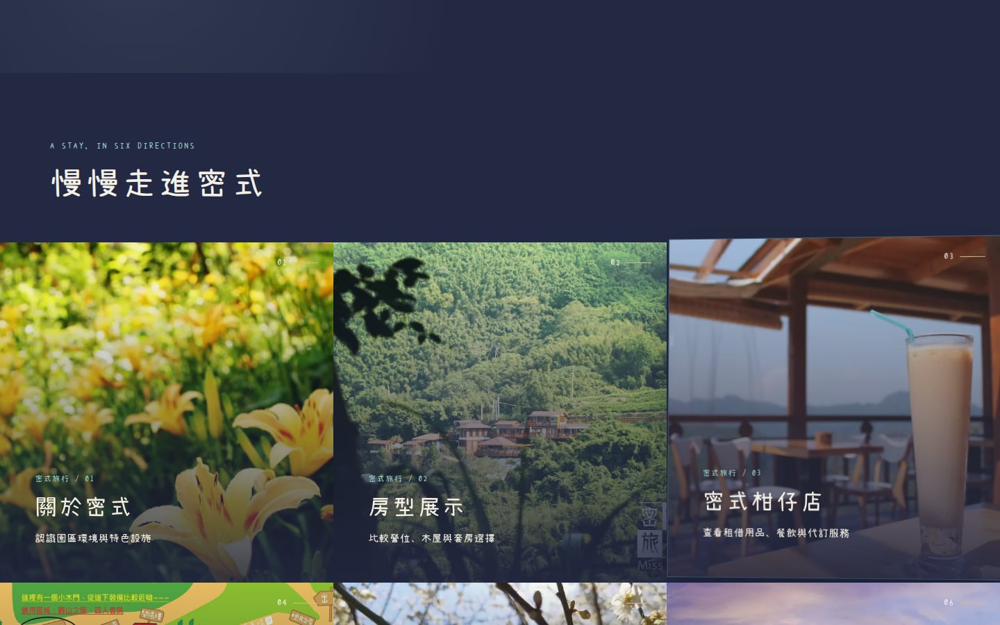
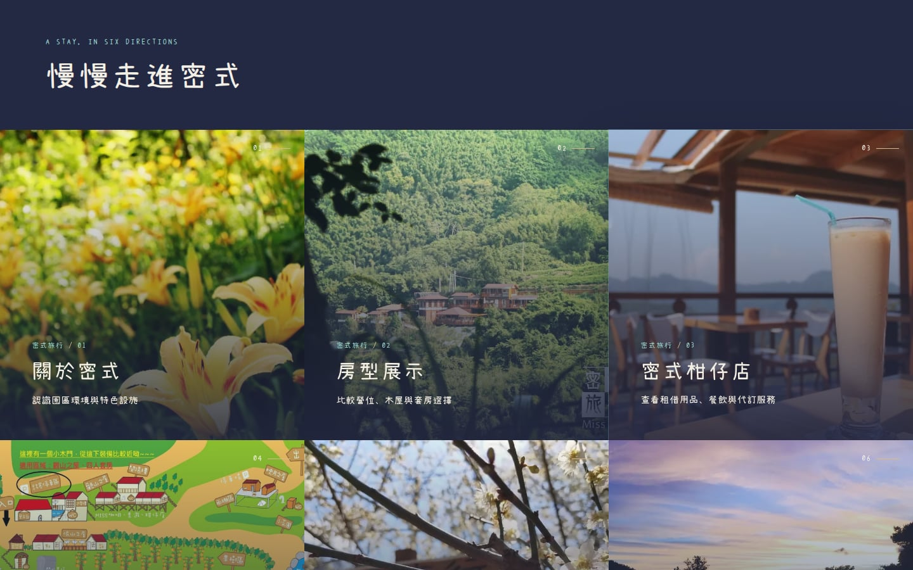
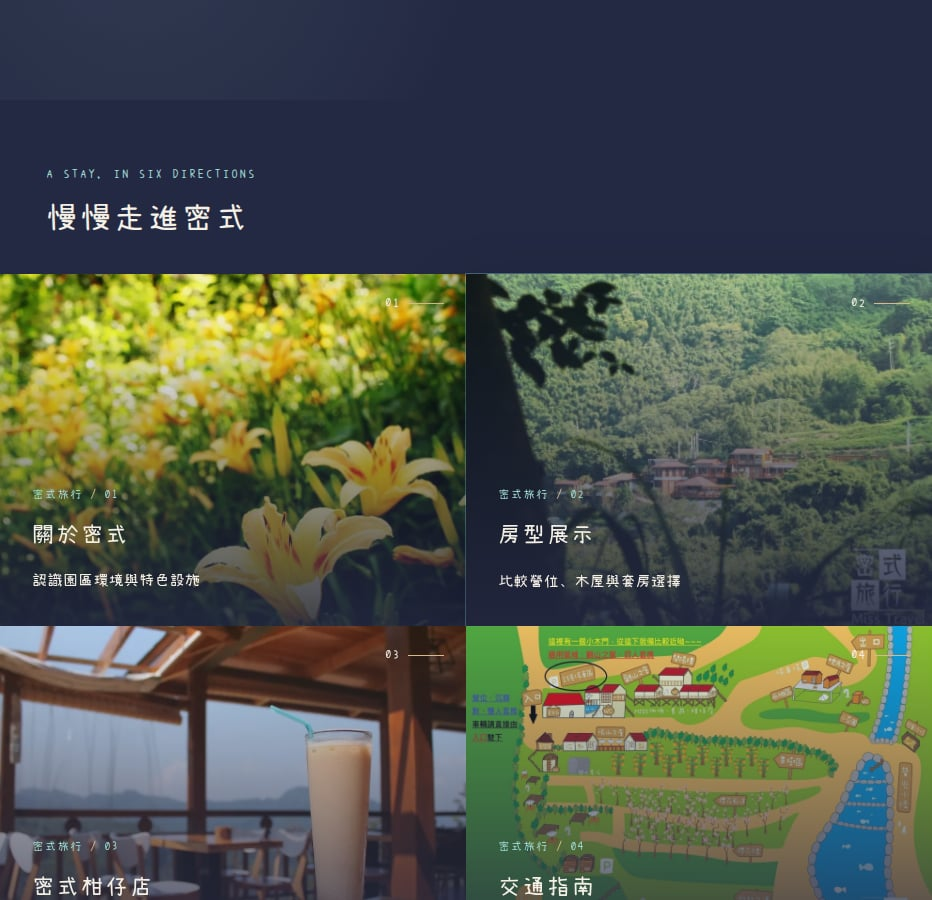
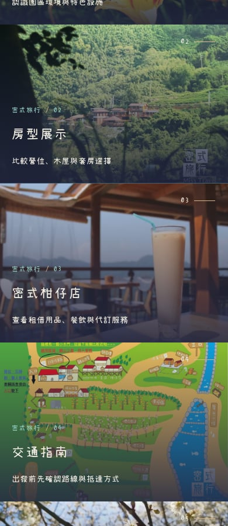

# 首頁橫向捲動修正與下一階段 SEO 盤點

網站實作與最終本機驗證版本：`0caec00a77778737ff47eaaa58d3188c81bd5d0d`。接續 PR #64；未合併，不改正式站。

## 驗收入口

[本機首頁](http://localhost:4336/) · [菜單](http://localhost:4336/infos/menu/) · [園區地圖](http://localhost:4336/infos/map/) · [房型比較](http://localhost:4336/rooms/)。本機需使用者電腦的 WSL 預覽程序保持運作。

[雲端首頁](https://misstravel-git-feat-spatial-4f772f-bag571ivy3470-1104s-projects.vercel.app/) 沿用原有 Vercel 登入保護。

## 已修正：滿版卡片在 hover 時把文件撐寬

問題只在互動時出現，靜止畫面及 reduced-motion 掃描不會重現。在 1440px 視窗，最右側 tile 旋轉後實測 `document.scrollWidth=1444`，且實際能捲到 `scrollX=4`。原測試因此不足，這不是將 scrollbar 隱藏就完成的問題。

`Tiles.astro` 現在保持卡片外框、文字與點擊範圍固定，僅讓照片在卡片既有裁切範圍內回應指標。保留照片縮放、景深及鍵盤 focus。沒有對 html/body 加 overflow hidden/clip，沒有隱藏 scrollbar，也未更動縮圖與比較面板的區域橫向捲動。

新增 E2E 涵蓋 390、767、768、932、1020、1021、1067、1440、1920px，包括 767px 與 1020px 斷點兩側。逐張移動至卡片左右邊緣及鍵盤焦點，每次連續量測至少 650ms，涵蓋完整照片動效及高更新率螢幕，另確認移出指標後與卡片／文字位置不動，並真的嘗試水平捲動；另測 reduced-motion 及照片區域的整卡點擊。修正前測試失敗，修正後均通過。

## 同時修正：菜單／園區地圖的圖片預留比例

只更正兩個 width/height 屬性，原圖、src、alt、正文與價格不改。

| 圖片 | 原錯誤宣告 | 修正後原始尺寸 | 390px 測試：圖片載入前 → 後高度 |
| --- | --- | --- | --- |
| 菜單 | 1200 × 800 | 1077 × 1522 | 原 221.33 → 469.17px；新 469.17 → 469.17px |
| 園區地圖 | 1200 × 800 | 2000 × 1500 | 原 221.33 → 249px；新 249 → 249px |

測試先延後真正的圖片回應、量未載入的占位高度，再放行回應，比對載入後高度。1440px 同樣通過。這證明修掉這兩個尺寸導致的跳動，不等於已取得全站真實訪客 CLS 分數。Google 的 [CLS 改善指南](https://web.dev/articles/optimize-cls) 建議以正確 width/height 或 aspect ratio 預留圖片空間。

## 本輪驗證

| 項目 | 結果 |
| --- | --- |
| 完整 verify | 29 個測試檔、340／340；npm audit 0 |
| 完整 Chromium E2E | 144／144，retries=0；原 130 案例加 10 個首頁溢出、4 個延遲圖片測試 |
| 跨引擎互動 | Chromium／Firefox／WebKit ×390／932／1440px，9／9；每組逐張 hover、測文件溢出並確認比較面板仍可橫向捲動 |
| 本輪 SEO 與正文保留 | 26 頁 title/meta/canonical/JSON-LD、全部 body 可讀文字、圖片 src/alt 都一致；robots、sitemap、feed 位元組也一致 |
| 原始照片與字型 | 均未改動；251 個原保護檔中只有兩個資訊 Markdown 的尺寸屬性變更 |
| 獨立靜態審查 | 見 independent-review.md，與實作工作階段分離；不是人工／美感認證 |

[完整 verify](verify.txt)、[144 項瀏覽器紀錄](browser-tests.txt)、[修正前首頁失敗](homepage-red.txt)、[修正前圖片失敗](image-stability-red.txt)、[跨引擎明細](cross-engine.json)、[內容與 SEO 比對](preservation.json)。

### 獨立審查的修正歷程

[第一輪](independent-review-initial.md) 指出滿版 tile 的 reset 應明確高於共用動效 selector，不能依賴 Astro 產生樣式的順序。因此將 transform reset 獨立為 `.tile[data-motion-card]`，但保留原 `.tile` 的尺寸與 grid 規則，避免破壞手機斷點。也補上 CSS 變數備援、767px 邊界、完整 650ms 取樣、pointer leave，以及實際卡片／文字座標不動的斷言。[複核](independent-review.md) 對最終程式給予 PASS。獨立 AI 沒有自行跑瀏覽器，最終本機瀏覽器結果由協調者另外執行並保存，不與靜態審查混為一談。

### 實際畫面

修正前，右邊界 tile 在旋轉時延伸出畫面：

修正後，仍有照片回饋，但卡片邊界不動：

932px 與手機視角

## SEO 還能做什麼：未冒充本輪已完成的工作

### 1. 依顯示用途提供不同尺寸的照片

目前建置輸出的 img 尚未提供 srcset 尺寸分流。房型檢視器的 72px 縮圖仍參照原圖（手機顯示尺寸可能更小）。在記憶體中，以原素材試做 WebP quality82 的不同寬度，結果如下；沒有修改或替換任何原圖。

| 範例 | 原始檔 | 192px 縮圖候選 | 768px 候選 |
| --- | ---: | ---: | ---: |
| 首頁 banner | 131,226 bytes | 6,356 bytes | 65,258 bytes |
| 密式之眼 suite_1_4 | 249,336 bytes | 8,576 bytes | 73,426 bytes |
| 櫻花之盡主圖 | 156,272 bytes | 8,456 bytes | 116,020 bytes |

這是不同尺寸編碼的檔案大小，不是全站加速比例、畫質等同保證或實際網路節省。若原圖已在快取，不應再次計算省下同一次下載。優先處理尚未讀取的縮圖／卡片，以原圖保留全螢幕畫質；圖片身份配對需同時調整，不能因 currentSrc 改變而破壞已核准的同照片銜接。高 DPR 也須選擇足夠清晰的候選。

Google 的 [圖片 SEO 指南](https://developers.google.com/search/docs/appearance/google-images) 建議響應式圖片，並保留正常 img src 備援。實作應使用同一原圖衍生檔，不更換攝影或品牌風格。[本輪檔案盤點與候選大小](seo-opportunities.json) 中的 imageElements 包含重複及隱藏元素，不能當成不同照片數或首屏下載次數。

### 2. 從真實搜尋資料決定下一頁要改什麼

使用既有 Google Search Console 的查詢／頁面／裝置資料，先看曝光較多但點擊率偏低的頁面、收錄狀態及搜尋需求，再調整搜尋標題或內容。不要把本機 200、結構化資料通過，當成 Google 已收錄或排名提升。本輪沒有讀取私人 Search Console 資料，沒有宣稱任何實際排名或成長數字。[官方報表說明](https://support.google.com/webmasters/answer/7576553?hl=en)

### 3. 量測速度、操作反應及畫面穩定性

針對首頁、房型列表及兩類房型，分開檢視 LCP／INP／CLS。尤其在照片載入、選單、比較及圖集操作後檢查，不只看首屏。先把實驗室重現與真實訪客資料分開；本輪實測的是兩張圖片的幾何高度變化，不是完整的 field Core Web Vitals。[Google 官方指標與門檻](https://developers.google.com/search/docs/appearance/core-web-vitals)

### 4. 將重要圖片資訊整理成可讀文字，保持事實不變

菜單及園區地圖頁主要內容仍是一張圖片。可保留原圖，另增加經核對的餐點／價格文字及設施位置說明；這會新增可見內容，應先確認範圍與資訊時效，不把文字偷偷塞進隱藏區。房型資料可以整理成既有設備的差異表，但不能推測設施或簡化掉方案條件。[Google 建議重要內容也有文字形式，結構化資料符合可見內容](https://developers.google.com/search/docs/appearance/ai-features)

### 5. 營區的本地搜尋資料

核對 Google 商家檔案的名稱、類別、聯絡、住宿／設施資訊、照片及官網連結是否與本站一致；回應真實評價，不能造評價。這是待檢視項目，不表示本輪已登入、發現或修改商家檔案。[Google 本地排名指南](https://support.google.com/business/answer/7091?hl=zh-Hant)

以上優先順序：先提供合適的照片尺寸，再用搜尋後台與真實訪客資料決定內容投資。不是繼續堆疊關鍵字、重複 schema，或以為測試全綠就代表排名一定上升。

## 範圍與限制

本輪維持深藍、原字型、原攝影、房價、營運規則與訂房流程。只改滿版卡片的動效承載層、兩張資訊圖片的尺寸 metadata，並新增回歸測試。未調整公開標題／摘要、未上傳縮圖候選、未讀取 Search Console/Business Profile 後台、未做真實 iPhone／Android 硬體驗證；跨引擎測試不等於真機認證。原工作目錄與前輪尚未提交的影片資產均保留。所有網路規格資料於 2026-09-16 核對。
