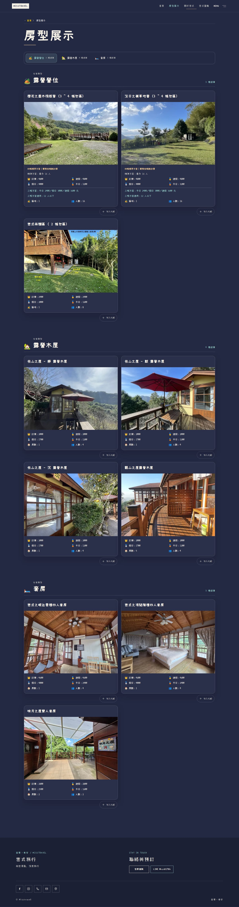
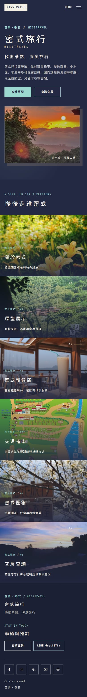
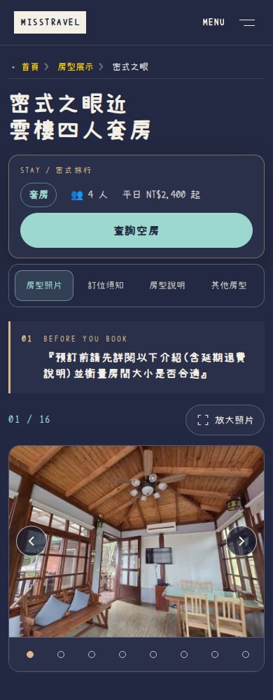
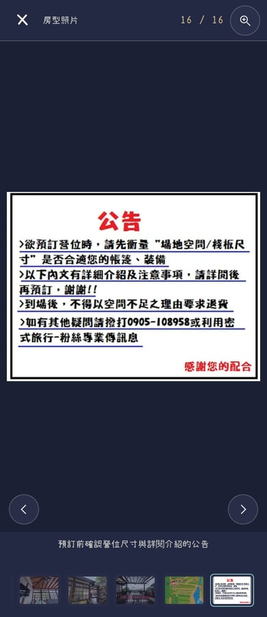
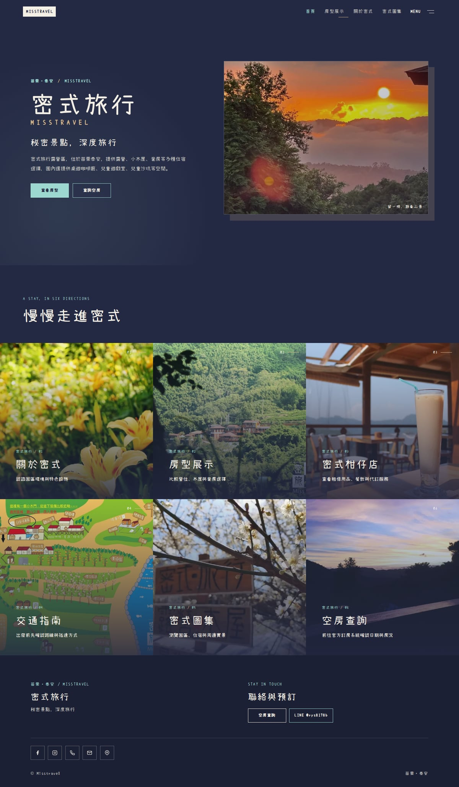
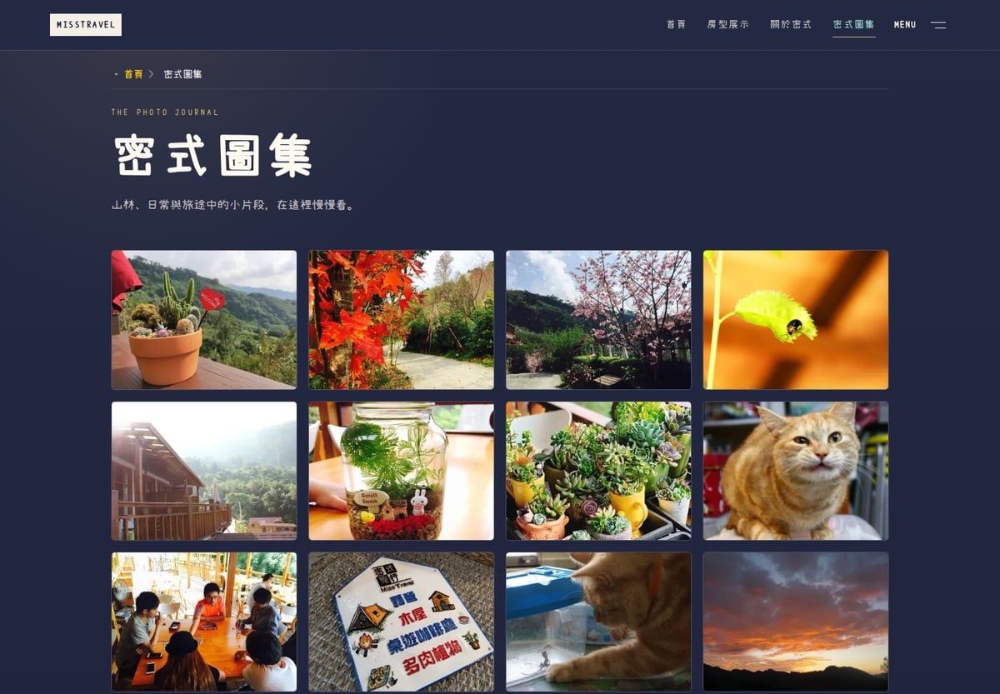
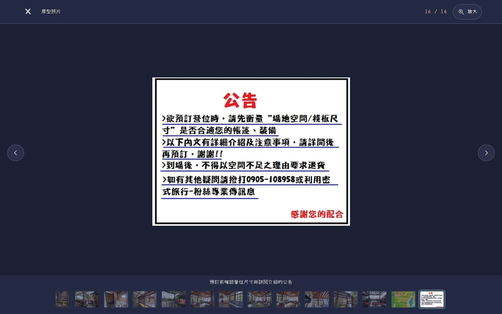

# SEO 與圖片效能優化：實作、量測與驗收

網站／測試版本：`df48ca94cc9a234989251629d6cf970c79a72b57`。本輪比較基準：`2ebfa2ab3d50bde7d28196d77be2b1b975b572eb`。接續 [PR #64](https://github.com/Lawa0921/misstravel/pull/64)，尚未合併，不直接改動正式站。

## 驗收入口

[本機首頁](http://localhost:4336/) · [房型列表](http://localhost:4336/rooms/) · [四人套房](http://localhost:4336/rooms/suite_1/) · [密式圖集](http://localhost:4336/galleries/)

本機入口需保持該電腦 WSL 預覽程序運作。[Vercel 雲端預覽](https://misstravel-git-feat-spatial-4f772f-bag571ivy3470-1104s-projects.vercel.app/) 保留原有 Vercel 登入保護，不將登入頁當成匿名網站驗收。

本輪不重做視覺設計：深藍、原字型、原攝影、照片排序、可見正文、房價與營運規則保持原樣。改善發生在實際圖片請求、預載、快取、搜尋摘要及相關狀態管理。

## 已實作的優化

### 合適尺寸的照片，而不是所有地方下載原始大圖

使用既有 sharp 在 Astro 建置時，從原圖產生 96／192／384／640／960／1280px 的候選；只保留寬度小於原圖、檔案也比原圖小的候選，不放大、不重新裁切、不覆寫原圖。瀏覽器透過標準 `srcset`／`sizes` 按顯示寬度與像素密度選擇。首頁、導覽卡、房型列表／輪播／相關房型、比較圖、圖集及看圖縮圖列均已接入，不只是生成了素材。

原始 `img src`、原圖連結、分享圖片、結構化資料、image-sitemap 仍指向原圖。尺寸圖及公告等需要閱讀的主圖維持原始解析度。全螢幕先接續已載入的同張照片，再升級原圖；縮圖列的候選上限為 384px，不下載所有原圖當作縮圖。

[Google 圖片指南](https://developers.google.com/search/docs/appearance/google-images) 說明響應式圖片及可抓取的正常 `src`。本次並未把生成縮圖另塞進 image-sitemap，原圖來源維持穩定。

### 預載、延後載入與快取一起調整

首頁與房型首圖的 preload 與真正顯示圖片共用同一份候選、`imagesrcset`／`imagesizes`，避免先下載大原圖再下載縮圖。延後輪播、未選房型與未開啟的比較大圖，不因新增 srcset 而提早全部下載。

衍生圖檔名依原圖內容與處理設定產生雜湊，僅 `/generated-images/` 使用一年 immutable 快取。原圖的快取策略、HTML、安全標頭與轉址保持原樣。[響應式預載說明](https://web.dev/articles/preload-responsive-images)

### 建置可以重現，原圖與資料不被破壞

管線在 `astro:config:setup` 自動執行，乾淨 checkout 不需手動先生成檔案。原圖或設定改變會得到新檔名；缺失／損壞的生成快取會修復。路徑穿越及輸入／輸出 symlink 有檢查；使用非公開快取目錄中的暫存檔原子寫入，不把半成品作為網站圖片供應。

沒有新增套件或外部圖片服務。生成資產不進 Git，單一內容模型說明仍在 [SEO_CONTENT_MODEL.md](../../SEO_CONTENT_MODEL.md)。乾淨建置實測產生 26 頁，處理 231 張原圖、988 個衍生檔約 29.17 MiB，用時約 39.78 秒。這增加伺服器建置／部署容量，但訪客只請求選中的候選，不能把這 29.17 MiB 當成單頁下載量。現版會掃描整個原圖目錄，未使用來源也可能產生候選；這項建置容量取捨已揭露。

## 實際圖片傳輸量：修改前後比較

### 手機寬度 390px、2 倍像素密度

| 頁面 | 修改前圖片 KB | 修改後圖片 KB | 減少 |
| --- | ---: | ---: | ---: |
| 首頁 | 608.0 | 457.3 | 24.8% |
| 房型列表 | 1,027.7 | 884.9 | 13.9% |
| 密式之眼套房 | 1,087.3 | 532.4 | 51.0% |
| 圖集 | 2,130.6 | 626.5 | 70.6% |

### 桌機寬度 1440px、1 倍像素密度

| 頁面 | 修改前圖片 KB | 修改後圖片 KB | 減少 |
| --- | ---: | ---: | ---: |
| 首頁 | 608.0 | 421.7 | 30.6% |
| 房型列表 | 1,596.3 | 714.9 | 55.2% |
| 密式之眼套房 | 1,087.3 | 440.5 | 59.5% |
| 圖集 | 2,130.6 | 626.5 | 70.6% |

<details><summary>390px、1 倍像素密度補充數據</summary>

| 頁面 | 修改前圖片 KB | 修改後圖片 KB | 減少 |
| --- | ---: | ---: | ---: |
| 首頁 | 608.0 | 262.4 | 56.8% |
| 房型列表 | 1,027.7 | 364.2 | 64.6% |
| 密式之眼套房 | 1,087.3 | 145.0 | 86.7% |
| 圖集 | 2,130.6 | 215.3 | 89.9% |

</details>

**量測方法與限制：**上述 KB 為十進位 1,000 bytes，只計完成的同源圖片回應內容，不包含 HTML、JavaScript、字型及回應標頭。每個條件各用兩個新瀏覽環境、停用 HTTP 快取、相同高度與操作，取兩次中位數；前後各 24 個落地頁樣本。依正常延後載入實際發出的請求計算，不假設全部圖片都已下載。Cloudflare 分析 beacon 已阻擋，避免污染統計。

這是本機 Chromium 實驗室測試，沒有網路節流，不是全站載入時間、速度倍數或搜尋排名成長。冷載入節省不能套用在已快取原圖的回訪。高 DPR 圖片選擇較大，所以不只展示 1 倍密度的最大節省。原始報告中的 LCP／CLS 是本機觀測而非真實訪客 Core Web Vitals，不能用來宣稱實際使用者全部達標。

看圖流程的 `thumbnailImageBytes` 會包含同 URL 在同流程其他位置的請求，因此保留為診斷資料，不把它當成純縮圖的額外下載節省。

[前測完整資料](network-before.json) · [最終版本後測](network-after.json) · [十二組對照](network-comparison.json)

## 搜尋摘要：提高準確性而不改營運資訊

| 頁面 | 本輪處理 |
| --- | --- |
| 首頁 | 摘要集中於苗栗泰安、營位／木屋／套房、費用與交通入口，移除冗長的泛用宣傳句 |
| 關於密式 | 說清楚園區介紹、咖啡廳／兒童空間，以及可查閱的訂房、規約、菜單與地圖 |
| 交通 | 對應大湖／清安豆腐街兩條實際圖文路線，不只寫「詳細指引」 |
| 菜單 | 明確告知是餐點及標示價格的原圖，可放大閱讀；不推測當日供應 |
| 園區地圖 | 區分園內配置與行車路線，說明原圖閱讀及交通指引入口 |
| 404 | 保留 noindex，使用不存在頁面的恢復導覽摘要，不再繼承首頁宣傳摘要 |

主標題與可見正文沒有改寫。首頁 WebSite 的 description 與新的首頁摘要同步；所有其他結構化資料及 canonical 維持原值。Google 可能使用頁面正文產生摘要，不保證照搬 meta description，也不保證改後排名上升。[Google 搜尋摘要說明](https://developers.google.com/search/docs/appearance/snippet)

[五個正常頁面的修改前後內容](snippet-changes.json)。歷史 guest-interface 契約只更新上述六頁的 SEO 雜湊，原段落、媒體及連結雜湊未改；另用 [26 頁精確保留檢查](preservation.json) 限制只能出現六組 description／社群摘要及首頁 WebSite description 的 19 個預期差異。

## 互動沒有因為壓小圖片而退步

響應式圖片讓同張照片在列表、詳細頁、全螢幕有不同 URL，因此動畫依完整原圖身分配對，不把版本 query 丟掉，更不把不同照片視為相同。原圖載入與裝飾動畫的取消彼此獨立。

驗證中先重現兩個問題，再修正：低解析度照片升級原圖會突然放大位置，以及慢速原圖下載完成會把已開啟的縮放／平移重設。現在用原始尺寸預留同樣的全螢幕空間，原圖升級保留目前縮放、平移及已看照片位置。晚到的裝飾動畫超過開啟 400ms 就略過，不會幾秒後又突然飛入。

[修正前實際失敗](progressive-red.txt) · [修正後針對性測試](progressive-green.txt) · [最終完整瀏覽器結果](browser-tests.txt)

## 最終驗證

| 檢查 | 結果 |
| --- | --- |
| 完整 verify | 32 個測試檔、352／352；npm audit 0 vulnerabilities |
| 完整 Chromium E2E | 153／153，retries=0；包含原有互動與九個新圖片案例 |
| 全站瀏覽器檢查 | 26 頁 ×360／390／768／1440px，104／104；無水平溢出、破圖、程式例外 |
| 跨瀏覽器互動 | Chromium／Firefox／WebKit ×手機 DPR2／桌機，6／6；非實體手機認證 |
| 無生成快取的乾淨建置 | 26 頁成功，來源 commit 同本輪最終版本 |
| SEO 與正文精確比對 | 26 頁可見文字、H1～H6、標題、連結、原圖來源均保留；只有已列出的摘要差異 |
| 原素材／字型 | 251 個原保護檔案中，只有 menu/map 的 metadata 摘要變動；所有原照片和字型 bytes 不變 |
| GitHub CI | [網站版本 CI 成功](https://github.com/Lawa0921/misstravel/actions/runs/35065819635) |
| 獨立 AI 對抗審查 | 最終 PASS；不是人工使用性／美感或完整無障礙認證 |

[驗證摘要](verification.json) · [verify 紀錄](verify.txt) · [乾淨建置](clean-build.txt) · [跨引擎明細](cross-browser.json) · [全站結果](all-pages.json)

第一輪獨立審查 [NOT PASS](independent-review-initial.md) 與兩次修正複核 [PASS](independent-review-second.md)、[最終來源 PASS](independent-review-final.md) 分開保存。AI 審查只讀原始碼與既有證據，並未冒稱自己執行瀏覽器；完整瀏覽器、跨引擎及資源量測由協調者實際執行。完整畫面已由工具產出，這輪額外目視核對首頁、列表、套房、圖集及全螢幕代表畫面，不把截圖產出等同每張人工逐一審核。

## 新版實際畫面



<details><summary>手機首頁、房型與看圖</summary>





</details>

<details><summary>桌機首頁、圖集與看圖</summary>





</details>

## 重現

在 `astro-site/`：

```bash
npm ci
npm run verify
npm run test:e2e
```

已有建置預覽：

```bash
CI=1 PLAYWRIGHT_BASE_URL=http://127.0.0.1:4336 npx playwright test --retries=0
node scripts/seo-performance-audit.mjs --base http://127.0.0.1:4336 --runs 2 --label current --output test-results/seo-performance
node scripts/seo-preservation-audit.mjs --before /path/to/before-dist --output test-results/seo-preservation.json
```

報告不含私人搜尋後台資料。未登入 Search Console／Google 商家檔案、未送出訂房付款、未合併或改動正式站。搜尋收錄、曝光、點擊與真實訪客指標要等正式發布後以實際資料觀測，不能用上述測試次數替代。
